# 1. 🔀 Configurar CI con Azure Pipelines<a id="16--configurar-ci-con-azure-pipelines"></a>

En esta sección se explica la configuración necesaria para las aplicaciones integradas con Pipeline de Azure DevOps como son SonarQube, Snyk, etc. También se incluyen los archivos que conforman dicho Pipeline.

## 1.1. Crear un Proyecto en Azure DevOps<a id="11-crear-un-proyecto-en-azure-devops"></a>

Como se explicó en la sección de [Prerrequisitos](#11-️-prerrequisitos) se debe poseer una organización en Azure DevOps. Una vez creada la organización, se puede seguir esta guía en la documentación oficial de Microsoft para crear el [proyecto](https://learn.microsoft.com/es-es/azure/devops/organizations/projects/create-project?view=azure-devops&tabs=browser).

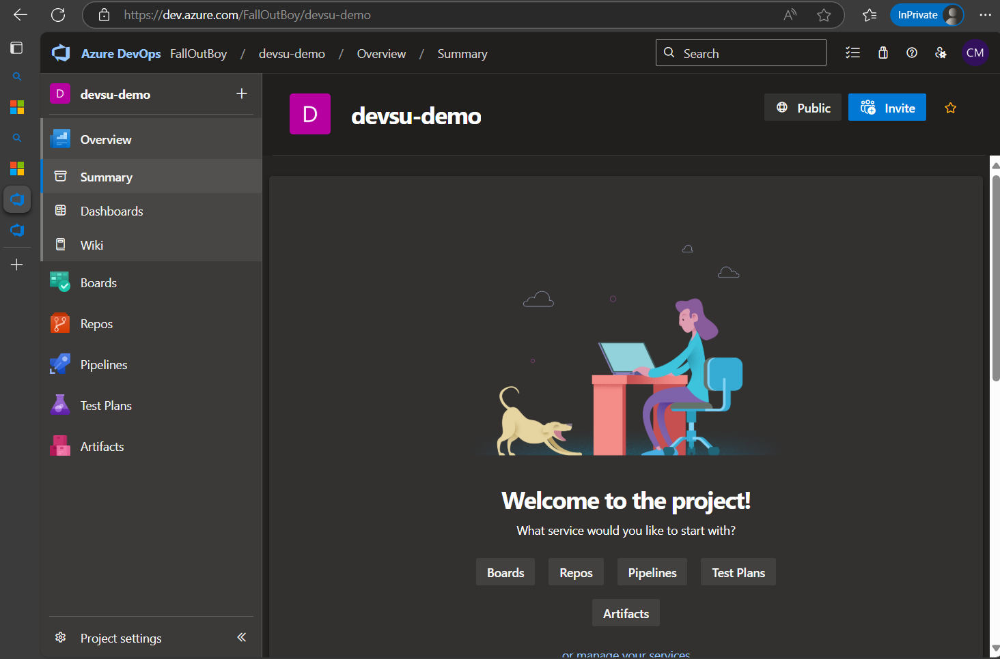

Ahora se deben configurar:

- Un Self-hosted Agent (agente auto-hospedado): para poder correr los pipelines en nuestra máquina local.
- Instalar las extensiones que se integran con las aplicaciones externas (Snyk, Trivy, etc...) y que permiten ejecutar las tareas del pipeline y mostrar reportes en el mismo.
- Crear las Service Connections para conectarnos a esas aplicaciones.

## 1.3. Crear Repositorio en Azure DevOps<a id="13-crear-repositorio-en-azure-devops"></a>

Luego de crear el proyecto se debe crear el repositorio en Azure Repos, para eso hay que hacer dirigirse al menú `Repos > New repository`. Le colocamos el nombre **devsu-demo-devops-nodejs** el mismo nombre de nuestro repositorio local.

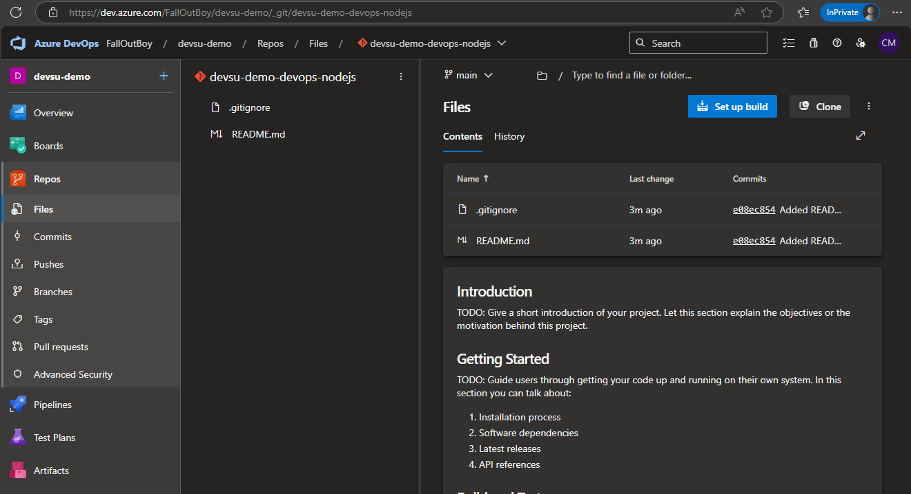

Luego se debe ejecutar estos comandos en el repositorio que se ha venido trabajando:

```bash
git remote add origin <url del repositorio>
git push -u origin main
```

Si hay algún error relacionado con el merge, se puede ejecutar este otro comando:

```bash
git pull origin main --allow-unrelated-histories
```

## 1.4. Instalar Self-hosted Agent<a id="14-instalar-self-hosted-agent"></a>

Instalar este aplicativo permite correr los pipelines de Azure DevOps usando los recursos de nuestra propia máquina y no usar los agentes de Microsoft que son de pago.

1. Para instalarlo se debe ir a: `Project Settings > Pipelines / Agent pools`. Se agrega un nuevo **Agent pool** de tipo *Self-hosted* con un nombre descriptivo.

    Evidencia:

    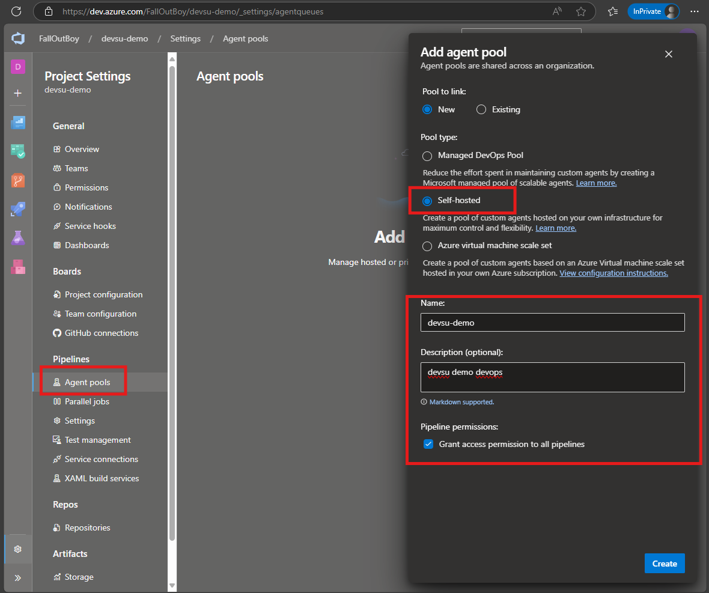

    Luego hay que ir a la pestaña **Security** y agregar permisos para el grupo **\Project Collection Build Service Accounts** como *Service Account*. Con esto se le permite al pipeline usar este agente.

    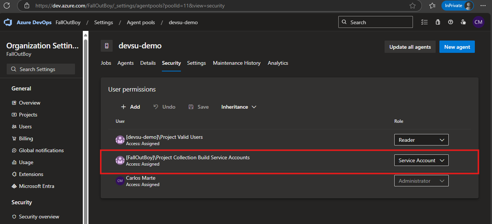

1. Luego que se crea el *pool* se debe crear el agente. El agente es un archivo descargable que se debe instalar en nuestra máquina. Se hace 'clic' en **New agent**, se descarga el archivo compatible con nuestro sistema operativo y se siguen las instrucciones para su instalación:

    Evidencia:

    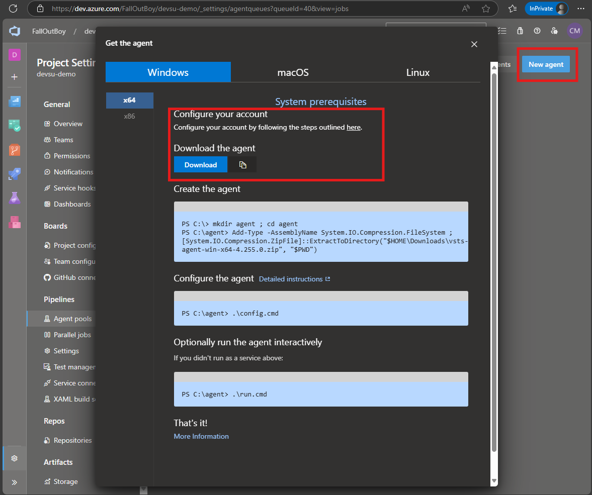

    Al momento de configurarlo solicitará un PAT *(Personal Access Token)* de Azure DevOps con eso se podrá conectar a nuestro proyecto y al pool. El PAT se obtiene en el menu **User Settings**. Se crea un PAT con Full Access y un nombre descriptivo, es importante colocar una fecha de expiración:

    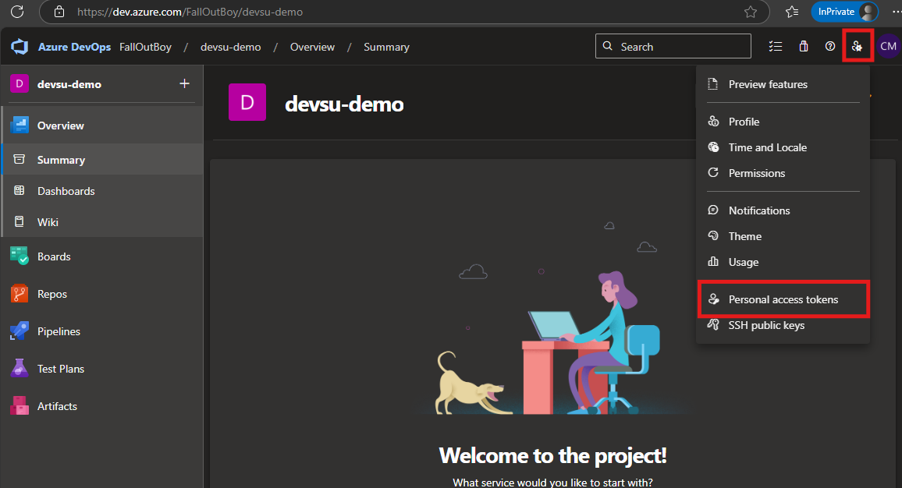

    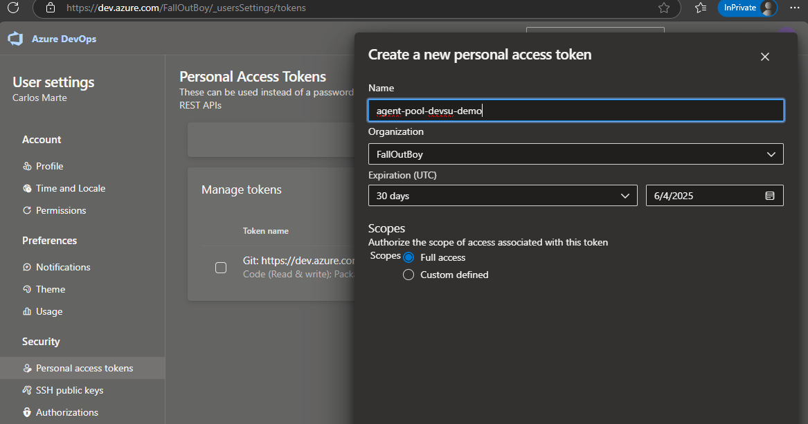

    Anotar el PAT generado para colocarlo cuando sea solicitado por la configuración del Agent pool. La configuración luce así:

    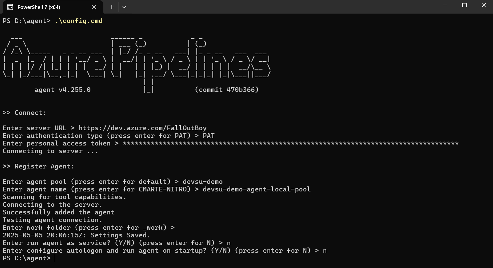

    Ahora el agente se muestra en el pool que se creó anteriormente. Aparece *offline* porque no se ha iniciado el agente local. Se debe iniciar cada vez que se corra el pipeline con este comando: `.\run.cmd`.

    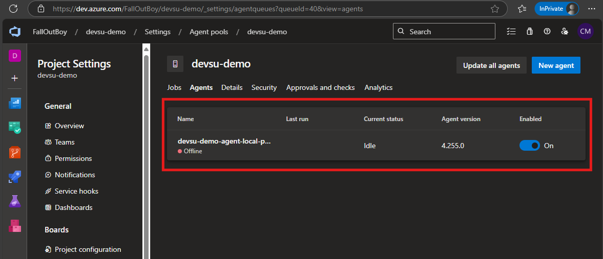

    > Nota: Se debe activar la opción `AZP_AGENT_CLEANUP_PSMODULES_IN_POWERSHELL="true"` para que no hayan conflictos entre la version PowerShell 5 que trae el agente por defecto y PowerShell 7 que "muy probablemente" esté instalada en la máquina Windows.

    Ejecutar el comando en un commando prompt en Windows:

    ```ps
    $env:AZP_AGENT_CLEANUP_PSMODULES_IN_POWERSHELL="true"
    ```

    Ahora si el agente estará listo para ejecutarse sin inconvenientes.

## 1.5. Instalar extensiones en Azure DevOps<a id="15-instalar-extensiones-en-azure-devops"></a>

Las extensiones en Azure DevOps se instalan a nivel de **Organización** y no de *Proyecto*, por lo que hay que dirigirse al menú `Organization Settings > General / Extensions`.

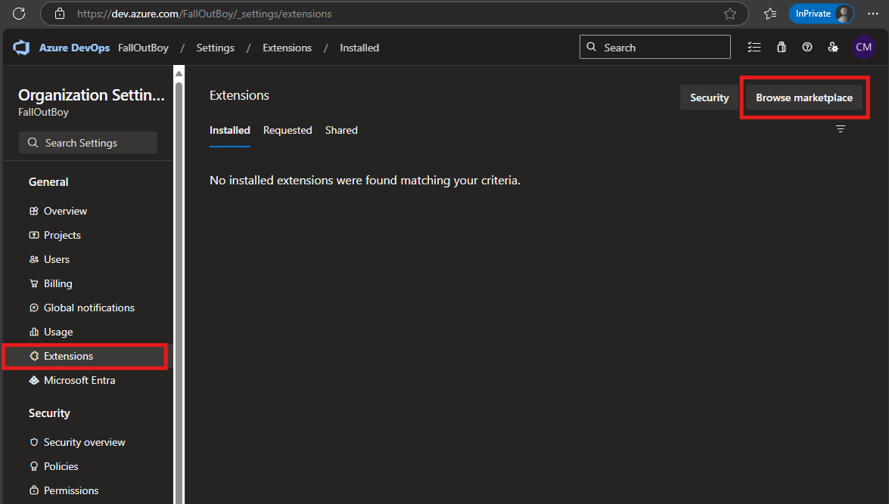

En [Visual Studio | Marketplace](https://marketplace.visualstudio.com/azuredevops/) instalar las siguientes extensiones:

- SARIF SAST Scans Tab
- SonarQube Server
- Docker build task
- trivy Aqua Security
- Snyk Security Scan

Una vez instaladas, aparecerán en la pestaña *Installed*

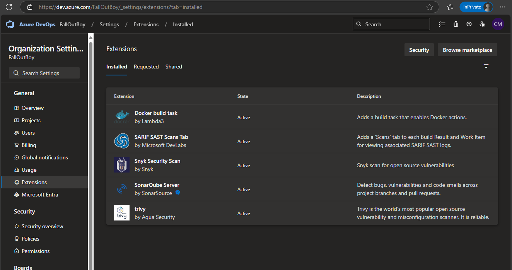

## 1.6. Configurar Service Connections Azure DevOps<a id="16-configurar-service-connections-azure-devops"></a>

Ahora hay que dirigirse nuevamente al proyecto, al menú `Project Settings > Pipelines / Service connections > Create service connection` para crear las conexión con las aplicaciones externas que usará el pipeline.

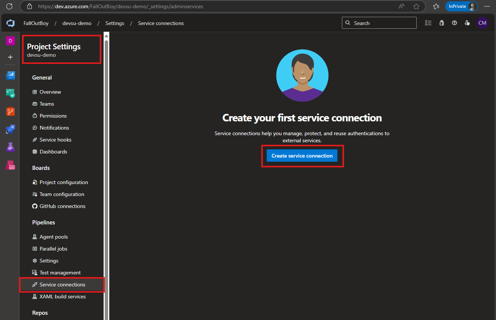

1. La primera que se creará es la de Docker Registry, para poder hacer push de la imagen de la aplicación `devsu-demo-devops-nodejs`.

    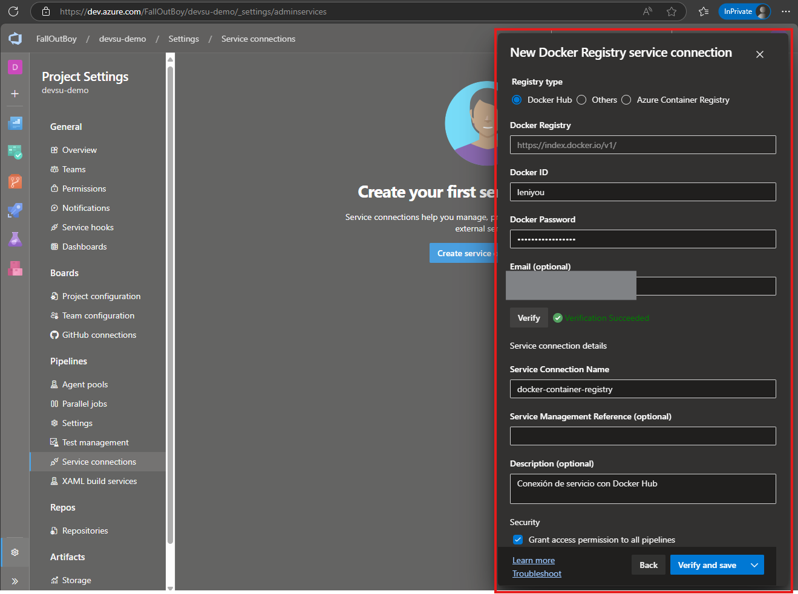

2. La siguiente será SonarQube Server. Aquí se debe utilizar el token que se generó en el paso anterior Configurar SonarQube:

      - **Server url**: Debe ser igual que la url y el puerto donde se inició el contenedor de SonarQube y debe estar *en ejecución* para que se pueda agregar el *Service Connection*.
      - **Token**: El token generado en SonarQube en el paso previo.

      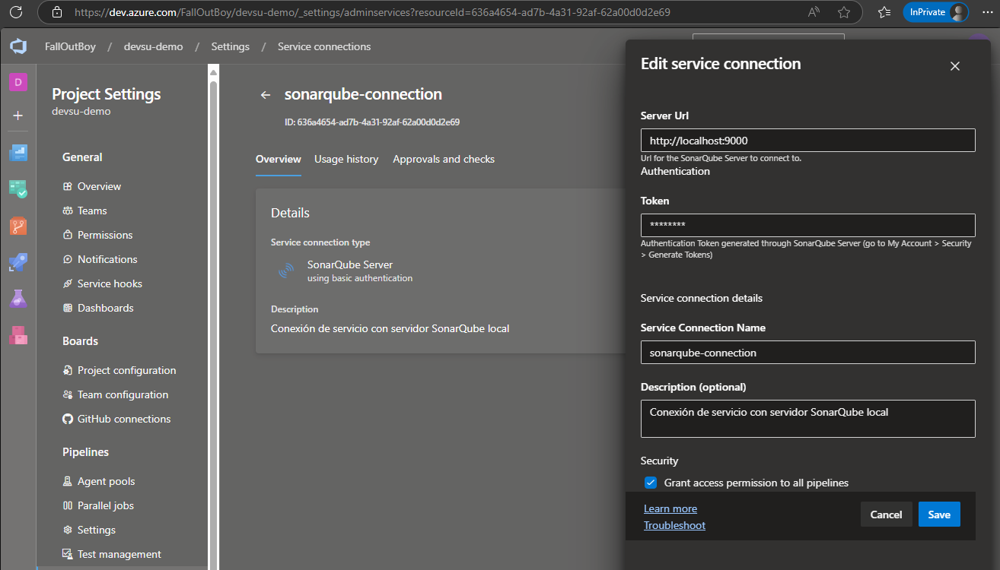

3. Ahora se configura la conexión con Snyk. Aqui se debe utilizar el token que se generó en el paso previo Configurar Snyk.

    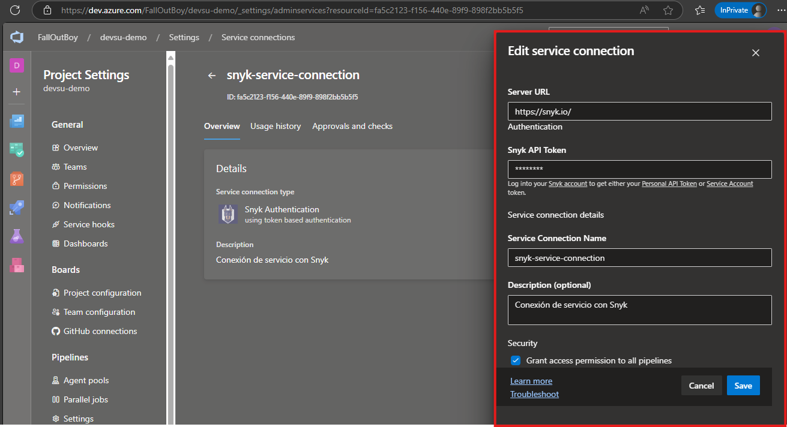

## 1.7. Configurar Secrets en Azure DevOps<a id="17-configurar-secrets-en-azure-devops"></a>

Se crearán unas variables tipo secrets que harán referencia a los Service Connections que se crearon recientemente, para poder usarlos como variables en el pipeline.

Para esto hay que ir al menú `Pipelines > Library`:

Se crea un nuevo grupo de variables llamado **global-secrets** que será usado en el pipeline.

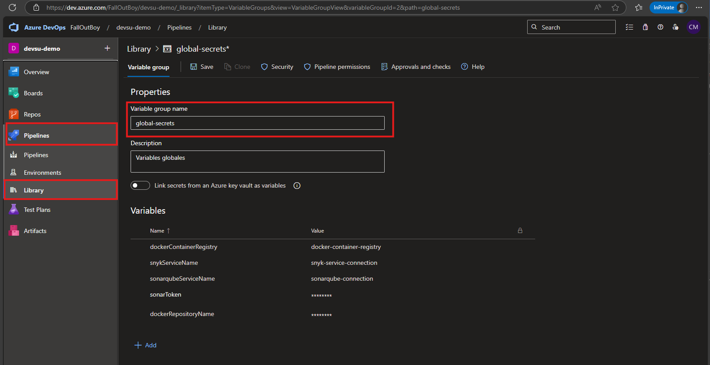

Se agregan las variables que hacen referencia a los *Service Connections*, adicional a esto también se agrega una variable llamada **sonarToken** con el token de SonarQube generado en pasos previos y **dockerRepositoryName** con el nombre de usuario y el nombre del repositorio `user/nombre-del-repositorio` para que se pueda hacer `docker push` de la imagen.

## 1.8. Crear los ambientes en el Pipeline<a id="18-crear-el-ambiente-prod-en-el-pipeline"></a>

Se crea un ambiente llamado **prod** en el pipeline para aprobar manualmente los pases a producción:

Evidencia:

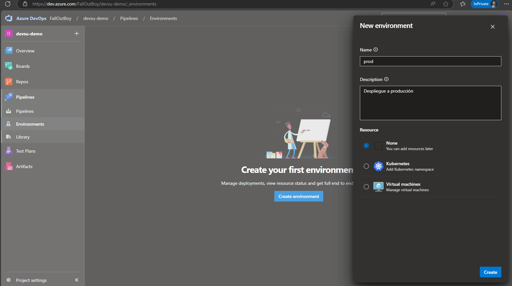

Luego se asigna el grupo que deberá aprobar el despliegue al ambiente de producción:

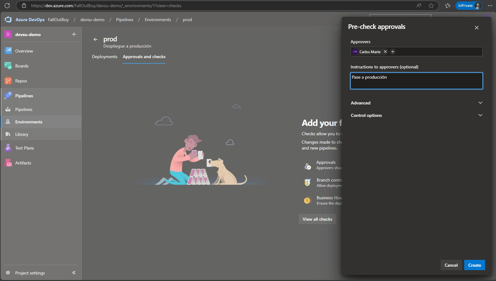

Se crea un ambiente llamado **qa** en el pipeline para aprobar manualmente los pases al ambiente QA para pruebas. Se usan los mismos parámetros que se usaron para el ambiente producción.

## 1.9. Configurar Archivos Azure Pipelines<a id="19-configurar-archivos-azure-pipelines"></a>

En esta parte se crean los archivos que conformarán el CI pipeline de Azure DevOps.

1. Se crea el archivo `azure-pipelines.yml` en la raíz del proyecto:

    ```bash
    touch azure-pipelines.yml
    ```

    Con el contenido:

    ```yaml
    trigger:
      branches:
        include:
          - main

    pool:
      name: 'devsu-demo' # <-- Agente Auto-Hospedado

    variables:
      - template: .azure-pipelines/variables.yml
      - group: global-secrets

    stages:
      - stage: BuildAndTest
        displayName: Compilación y Pruebas de Código
        jobs:
          - job: BuildAndTestCode
            steps:
              - template: .azure-pipelines/build-and-test-code.yml
                parameters:
                  repositoryName: '$(Build.Repository.Name)'
                  sonarqubeServiceName: '$(sonarqubeServiceName)'
                  sonarToken: '$(sonarToken)'

      - stage: DevSecOps
        displayName: Análisis de Vulnerabilidades
        dependsOn: [BuildAndTest]
        jobs:
          - job: VulnerabilityScan
            steps:
              - template: .azure-pipelines/vulnerability-scan.yml
                parameters:
                  repositoryName: '$(Build.Repository.Name)'
                  snykServiceName: '$(snykServiceName)'

      - stage: Versioning
        displayName: Versionamiento del Proyecto
        dependsOn: [BuildAndTest]
        jobs:
          - job: GitVersion
            displayName: Versionar Proyecto
            steps:
              - template: .azure-pipelines/git-version.yml

      - stage: Dockerize
        displayName: Construir y subir Imagen Docker
        dependsOn: [DevSecOps, Versioning]
        jobs:
          - job: BuildAndPushDocker
            displayName: Construir y subir la imagen Docker
            variables:
              dockerTagAlpha: $[stageDependencies.Versioning.GitVersion.outputs['SetTags.dockerTagAlpha']]
              dockerTagBeta: $[stageDependencies.Versioning.GitVersion.outputs['SetTags.dockerTagBeta']]
              dockerTagProd: $[stageDependencies.Versioning.GitVersion.outputs['SetTags.dockerTagProd']]
              dockerTagFinal: $[stageDependencies.Versioning.GitVersion.outputs['SetTags.dockerTagFinal']]
            steps:
              - template: .azure-pipelines/build-and-push-docker.yml
                parameters:
                  dockerRepositoryName: '$(dockerRepositoryName)'
                  dockerContainerRegistry: '$(dockerContainerRegistry)'

      - stage: DeployToDev
        displayName: "Desplegar a DEV"
        dependsOn: [Versioning, Dockerize]
        jobs:
          - job: DeployToK8sDev
            condition: always()
            variables:
              envName: 'dev'
              dockerTag: $[ stageDependencies.Versioning.GitVersion.outputs['SetTags.dockerTagAlpha'] ]
            steps:
              - template: .azure-pipelines/deploy-to-k8s.yml

      - stage: DeployToQA
        displayName: "Desplegar a QA"
        dependsOn: [Versioning, DeployToDev]
        jobs:
        - deployment: DeployToK8sQA
          condition: succeeded()
          environment: 'qa'
          variables:
            envName: 'qa'
            dockerTag: $[ stageDependencies.Versioning.GitVersion.outputs['SetTags.dockerTagBeta'] ]
          strategy:
            runOnce:
              deploy:
                steps:
                  - template: .azure-pipelines/deploy-to-k8s.yml

      - stage: DeployToProd
        displayName: "Desplegar a PROD"
        dependsOn: [Versioning, DeployToQA]
        jobs:
          - deployment: DeployToK8sProd
            condition: succeeded()
            environment: 'prod'
            variables:
              envName: 'prod'
              dockerTag: $[ stageDependencies.Versioning.GitVersion.outputs['SetTags.dockerTagProd'] ]
            strategy:
              runOnce:
                deploy:
                  steps:
                    - template: .azure-pipelines/deploy-to-k8s.yml
    ```

    Explicación:

    - **trigger**: Para iniciar el pipeline al momento de hacer *push* en la rama main.
    - **pool**: El nombre del *Agent pool* que se creó en el paso previo [Instalar Self-hosted Agent]<a id="161-instalar-self-hosted-agent"></a>.
    - **variables**: Para incluir el *grupo de variables* que se creó en el paso previo [Configurar Secrets]<a id="165-configurar-secrets-en-azure-devops"></a>. Y un archivo de variables para centralizarlas.
    - **stages**: Cada *stage* cumple un requerimiento del ejercicio práctico.
      - `stage: BuildAndTest`: En este se construye y se prueba la aplicación.
      - `stage: DevSecOps`: En este se escanea la aplicación para buscar vulnerabilidades.
      - `stage: Versioning`: Este se encarga del versionado del proyecto y de crear las imágenes para cada ambiente.
      - `stage: Dockerize`: Aquí se construye la imagen docker, la analiza con Trivy y luego hace el *push* al registro de Docker Hub con las etiquetas correspondientes para cada ambiente.
      - `stage: DeployToDev`: Despliegue al ambiente de desarrollo, siempre se ejecuta.
      - `stage: DeployToQA`: Despliegue al ambiente de QA/Pruebas, requiere aprobación manual en Azure DevOps.
      - `stage: DeployToProd`: Despliegue al ambiente de Producción, requiere aprobación manual en Azure DevOps.

2. Ahora se crea un directorio nuevo para alojar los archivos del pipeline:

    ```bash
    mkdir .azure-pipelines
    ```

3. Se crea el archivo **[build-and-test-code.yml](./.azure-pipelines/build-and-test-code.yml)** para construir y probar la aplicación:

    ```bash
    touch .azure-pipelines/build-and-test.yml
    ```

    Con el siguiente contenido:

    ```yaml
    ---
    parameters:
      - name: repositoryName
        type: string
      - name: sonarqubeServiceName
        type: string
      - name: sonarToken
        type: string
      - name: nodeVersion
        type: string
        default: '$(nodeVersion)'

    steps:

      # -- Instalación de dependencias -- #
      - task: NodeTool@0
        displayName: "Instalar Node.js ${{ parameters.nodeVersion }}"
        inputs:
          versionSpec: '${{ parameters.nodeVersion }}'

      - pwsh: |
          Write-Host "Instalando dependencias de Node.js"
          npm install
        displayName: "Instalar dependencias de Node.js"

      # -- Pruebas Unitarias-- #
      - pwsh: |
          Write-Host "Ejecutando pruebas unitarias"
          npm run test:ci
        displayName: "Ejecutar pruebas unitarias"
        continueOnError: true

      - task: PublishTestResults@1
        displayName: "Publicar resultados de pruebas unitarias"
        inputs:
          testResultsFormat: 'JUnit'
          testResultsFiles: 'junit.xml'
          searchFolder: "$(System.DefaultWorkingDirectory)/test-results"

      # -- Análisis Estático de código con ESLint -- #
      - pwsh: |
          Write-Host "Ejecutando análisis de código estático con ESLint"
          npx eslint . --ext .js
        displayName: "Ejecutar análisis de código estático con ESLint"
        continueOnError: true

      # -- Análisis de código con SonarQube  -- #
      - task: SonarQubePrepare@7
        displayName: "Preparar análisis de SonarQube"
        inputs:
          SonarQube: '${{ parameters.sonarqubeServiceName }}'
          scannerMode: 'cli'
          configMode: 'file'
          cliProjectKey: '${{ parameters.repositoryName }}'
          cliProjectName: '${{ parameters.repositoryName }}'
          cliSources: 'src'
          extraProperties: |
            sonar.token=${{ parameters.sonarToken }}
        
      - pwsh: |
          Write-Host "ls"
          ls $(System.DefaultWorkingDirectory)/test-results/*

      - task: SonarQubeAnalyze@7
        displayName: "Analizar código con SonarQube"
        inputs:
          jdkversion: 'JAVA_HOME'

      - task: SonarQubePublish@7
        displayName: "Publicar resultados de SonarQube"
        inputs:
          pollingTimeoutSec: '300'

      # -- Publicar resultados de cobertura de código -- #
      - task: PublishCodeCoverageResults@1
        displayName: "Publicar resultados de cobertura de código"
        inputs:
          summaryFileLocation: '$(System.DefaultWorkingDirectory)/test-results/coverage/cobertura-coverage.xml'
    ```

    Explicación

    - Los dos primero tasks son para instalar Node.js y las dependencias del proyecto.
    - Luego se ejecutan las pruebas unitarias y se publican los resultados.
    - Se usa ESLint para escaneo y linter del código.
    - Se ejecuta el análisis de SonarQube.
    - Por último se publica el resultado de la cobertura de código.

4. Se crea el archivo **[vulnerability-scan.yml](./.azure-pipelines/vulnerability-scan.yml)** para el análisis de las vulnerabilidades:

    ```bash
    touch .azure-pipelines/vulnerability-scan.yml
    ```

    Con el contenido:

    ```yaml
    ---
    parameters:
      - name: repositoryName
        type: string
      - name: snykServiceName
        type: string
      - name: gitleaksReportDir
        type: string
        default: "$(System.DefaultWorkingDirectory)/.gitleaks_report"

    steps:
      - checkout: self
        persistCredentials: true

      # -- Find secrets with Gitleaks / Escaneo de secretos expuestos con Gitleaks -- #
      - task: PowerShell@1
        displayName: "Instalar y configurar Gitleaks en Windows"
        inputs:
          targetType: 'inline'
          script: |
            $ErrorActionPreference = "Stop"

            # Variables
            $gitleaksUrl = "https://github.com/gitleaks/gitleaks/releases/download/v8.15.1/gitleaks_8.15.1_windows_x64.zip"
            $zipPath = "$env:BUILD_ARTIFACTSTAGINGDIRECTORY\gitleaks.zip"
            $extractPath = "$env:BUILD_ARTIFACTSTAGINGDIRECTORY\gitleaks"

            # Descargar Gitleaks ZIP
            Invoke-WebRequest -Uri $gitleaksUrl -OutFile $zipPath

            # Extraer el ZIP
            Expand-Archive -Path $zipPath -DestinationPath $extractPath -Force

            # Agregar Gitleaks al PATH temporalmente
            $env:Path += ";$extractPath"

            # Verificar versión
            gitleaks version

            # Crear directorio de reportes si no existe
            $reportDir = "${{ parameters.gitleaksReportDir }}"
            if (Test-Path -Path $reportDir) {
              Write-Host "El directorio para los reportes Gitleaks ya existe"
            } else {
              Write-Host "Creando directorio de reportes de Gitleaks"
              New-Item -ItemType Directory -Path $reportDir | Out-Null
              Invoke-WebRequest -Uri "https://raw.githubusercontent.com/gitleaks/gitleaks/refs/heads/master/report_templates/basic.tmpl" -OutFile "$reportDir\basic.tmpl"
            }

      - task: PowerShell@1
        displayName: "Escanear repositorio con Gitleaks"
        inputs:
          targetType: 'inline'
          script: |
            $ErrorActionPreference = "Stop"
      
            $reportDir = "${{ parameters.gitleaksReportDir }}"
            $gitleaksPath = "$env:BUILD_ARTIFACTSTAGINGDIRECTORY\gitleaks\gitleaks.exe"
      
            # Ejecutar escaneo SARIF
            & "$gitleaksPath" git . --log-opts -1 -v --exit-code 0 --platform azuredevops --report-path "$reportDir\gitleaks-report.sarif" --report-format sarif
      
            # Ejecutar escaneo con plantilla HTML
            & "$gitleaksPath" git . --log-opts -1 -v --exit-code 0 --platform azuredevops --report-path "$reportDir\gitleaks-report.html" --report-format template --report-template "$reportDir\basic.tmpl"
      
      - task: PublishBuildArtifacts@1
        displayName: "Publicar reporte de Gitleaks formato Sarif"
        inputs:
          PathtoPublish: '${{ parameters.gitleaksReportDir }}/gitleaks-report.sarif'
          ArtifactName: 'CodeAnalysisLogs'
          publishLocation: 'Container'

      - task: PublishBuildArtifacts@1
        displayName: "Publicar reporte de Gitleaks formato HTML"
        inputs:
          PathtoPublish: '${{ parameters.gitleaksReportDir }}/gitleaks-report.html'
          ArtifactName: 'CodeAnalysisLogs'
          publishLocation: 'Container'

      # -- Snyk vulnerability scan / Escaneo de vulnerabilidades con Snyk -- #
      - task: SnykSecurityScan@1
        displayName: "Escanear vulnerabilidades con Snyk"
        inputs:
          projectName: '${{ parameters.repositoryName }}'
          serviceConnectionEndpoint: '${{ parameters.snykServiceName }}'
          testType: 'app'
          monitorWhen: 'always'
          failOnIssues: false
    ```

    Explicación:

    - Se instala y configura Gitleaks para el escaneo de secretos, passwords y llaves expuestas.
    - Se ejecuta el análisis de Snyk para escaneo de vulnerabilidades y dependencias deprecadas.

5. Se crea el archivo **[build-and-push-docker.yml](./.azure-pipelines/build-and-push-docker.yml)** para construir y subir la imagen Docker al registro Docker Hub.

    ```bash
    touch .azure-pipelines/build-and-push-docker.yml
    ```

    Con el contenido:

    ```yaml
    ---
    parameters:
      - name: repositoryName
        type: string
        default: 'devsu-demo-devops-nodejs'
      - name: dockerRepositoryName
        type: string
      - name: dockerContainerRegistry
        type: string

    steps:
      - checkout: self
        lfs: true

      - task: Docker@1
        displayName: 'Iniciar sesión Docker Hub'
        inputs:
          command: 'login'
          containerRegistry: ${{ parameters.dockerContainerRegistry }}

      # -- Docker build -- #
      - task: Docker@1
        displayName: "Construir imagen con Docker build"
        inputs:
          command: 'build'
          containerRegistry: '${{ parameters.dockerContainerRegistry }}'
          repository: '${{ parameters.dockerRepositoryName }}'
          buildContext: '.'
          Dockerfile: "**/Dockerfile"
          tags: |
            $(dockerTagAlpha)
            $(dockerTagBeta)
            $(dockerTagProd)
            $(dockerTagFinal)
            latest

      # -- Escaneo de vulnerabilidades en la imagen Docker con Trivy -- #
      - template: trivy-scan.yml
        parameters:
          dockerRepositoryName: '${{ parameters.dockerRepositoryName }}'

      # -- Docker Push al registro en DockerHub -- #
      - task: Docker@1
        displayName: "Subir imagen con Docker push"
        inputs:
          command: 'push'
          containerRegistry: '${{ parameters.dockerContainerRegistry }}'
          repository: '${{ parameters.dockerRepositoryName }}'
          tags: |
            $(dockerTagAlpha)
            $(dockerTagBeta)
            $(dockerTagProd)
            $(dockerTagFinal)
            latest
    ```

    Explicación:

    - Se autentica en Docker Hub.
    - Se construye la imagen local con el comando `docker build`.
    - Se analiza la imagen construida con Trivy para buscar vulnerabilidades críticas y altas.
    - Se hace *push* de la imagen hacia el registro de Docker Hub.

6. Se crea el archivo **[trivy-scan.yml](./.azure-pipelines/trivy-scan.yml)** para escanear vulnerabilidades en la imagen Docker.

    ```bash
    touch .azure-pipelines/trivy-scan.yml
    ```

    Con el contenido:

    ```yaml
    ---
    parameters:
      - name: dockerRepositoryName
        type: string

    steps:
      # -- Escaneo de vulnerabilidades en la imagen Docker con Trivy -- #
      - task: trivy@1
        displayName: "Escaneo de vulnerabilidades con Trivy"
        inputs:
          method: install
          version: latest
          type: 'image'
          target: "docker.io/${{ parameters.dockerRepositoryName }}:$(Build.BuildNumber)"
          scanners: 'vuln, misconfig'
          ignoreUnfixed: true
          ignoreScanErrors: true
          severities: 'CRITICAL,HIGH'
          reports: 'html, sarif'
          publish: true
          exitCode: 0
    ```

7. Se crea el archivo **[deploy-to-k8s.yml](./.azure-pipelines/deploy-to-k8s.yml)** con las tareas para el despliegue de la aplicación en un cluster local de Kubernetes usando minikube.

    ```bash
    touch .azure-pipelines/deploy-to-k8s.yml
    ```

    Con el contenido:

    ```yaml
    ---
    parameters:
      - name: k8sOverlayPath
        type: string
        default: '$(k8sOverlayPath)'
      - name: projectName
        type: string
        default: '$(projectName)'
      - name: gitEmail
        type: string
        default: '$(gitEmail)'
      - name: gitUser
        type: string
        default: '$(gitUser)'
    
    steps:
      # -- Configurar Kustomize -- #
      - pwsh: |
          ./scripts/configure-kustomize.ps1
        displayName: 'Configurar Kustomize'

      # -- Actualizar los tags de la imágenes Docker para el ambiente en específico -- #
      - pwsh: |
          ./scripts/update-kustomize-tag.ps1 -Env '$(envName)' -Version '$(dockerTag)' -Email '${{ parameters.gitEmail }}' -User '${{ parameters.gitUser }}'
        displayName: 'Actualizar image tag'

      # -- Se aplican los cambios en el Deployment -- #
      - pwsh: |
          Write-Host "Aplicando manifestos con Kustomize desde: ${{ parameters.k8sOverlayPath }}/$(envName)"
          & kubectl apply -k "${{ parameters.k8sOverlayPath }}/$(envName)"
        displayName: 'Aplicar Kustomize'

      - pwsh: |
          Write-Host "Esperando a que el deployment esté disponible..."
          & kubectl rollout status -n ${{ parameters.projectName }}-$(envName) deployment ${{ parameters.projectName }}-$(envName) --timeout=110s
          if ($LASTEXITCODE -ne 0) {
              Write-Error "Deployment no disponible. Revisa los eventos de Kubernetes."
              exit 1
          }
        displayName: 'Esperar rollout del Deployment'
      
      - task: PowerShell@1
        displayName: "Validar rollout $(envName)"
        inputs:
          targetType: inline
          script: |
            $ns = "${{ parameters.projectName }}-$(envName)"
            kubectl get pods -n $ns
            kubectl rollout status deployment/${{ parameters.projectName }}-$(envName) -n $ns

      - pwsh: |
          Write-Host "Recursos desplegados:"
          & kubectl get all | Out-String | Write-Host
          Write-Host "Ingress:"
          & kubectl get ingress -n ${{ parameters.projectName }}-$(envName) | Out-String | Write-Host
        displayName: 'Ver recursos desplegados'
    ```

    Explicación:

    - Se utiliza un script *configure-kustomize.ps1* para instalar y configurar el ejecutable de Kustomize.
    - Se utiliza un script *update-kustomize-tag.ps1* para actualizar los tags de las imagenes Docker para los ambientes específicos.
    - Se aplican los cambios en el Deployment.
    - Se validan los recursos desplegados.

8. Se crea el archivo **[git-version.yml](./.azure-pipelines/git-version.yml)** con la tarea para actualizar la versión del proyecto y crear los tags para cada ambiente.

    ```bash
    touch .azure-pipelines/git-version.yml
    ```

    Con el contenido:

    ```yaml
    ---
    steps:
     - checkout: self
       lfs: true

     - pwsh: ./scripts/update-tag-version.ps1
       displayName: Versionado
       name: "SetTags"
    ```

    Explicación:

    - Se utiliza un script *./scripts/update-tag-version.ps1* para versionar el proyecto.

9. Se crea el archivo [variables.yml](./.azure-pipelines/variables.yml) para alojar las variables recurrentes del pipeline:

    ```yaml
    ---
    # -- Variables -- #

    variables:
      - name: nodeVersion
        value: "13.x"

      - name: k8sOverlayPath
        value: 'environment/k8s/devsu-demo-devops-nodejs/overlays'

      - name: projectName
        value: "devsu-demo-devops-nodejs"

      - name: gitEmail
        value: '$(Build.RequestedForEmail)'
      - name: gitUser
        value: '$(Build.RequestedFor)'
    ```
