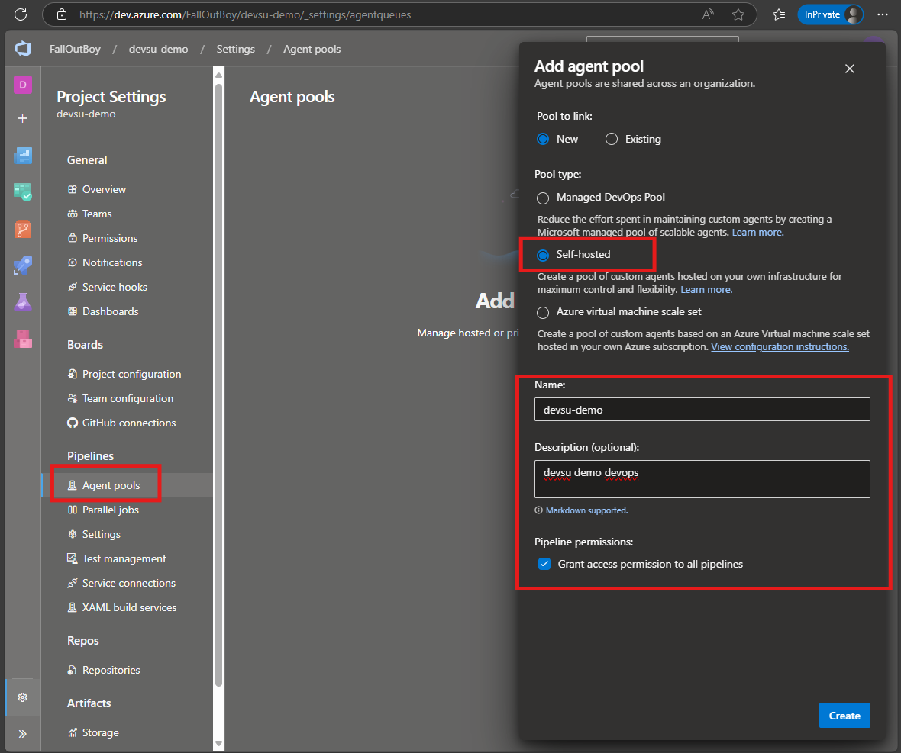
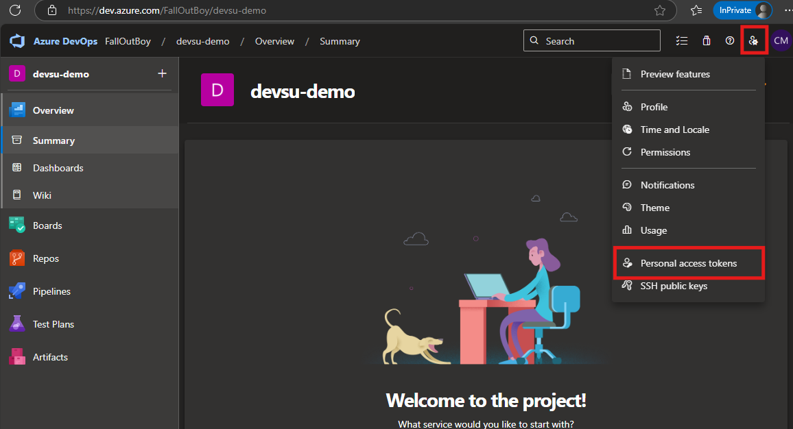
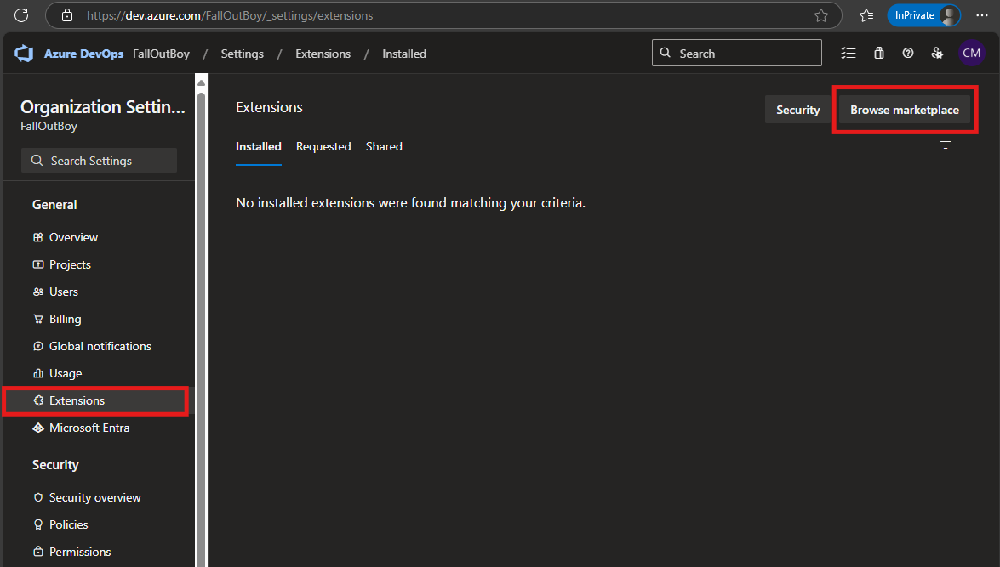
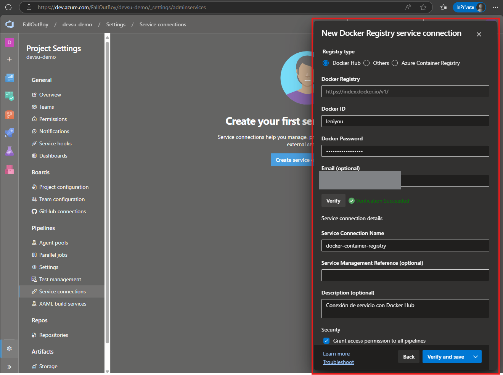
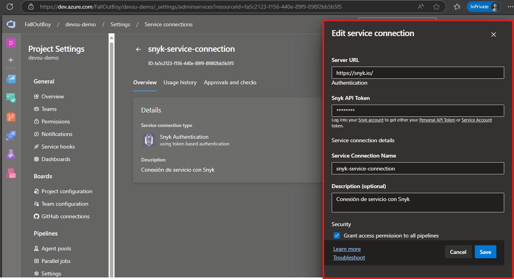
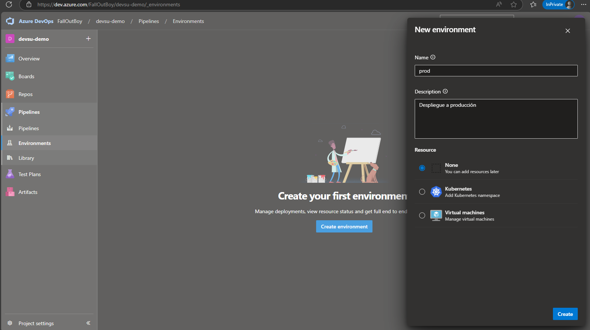
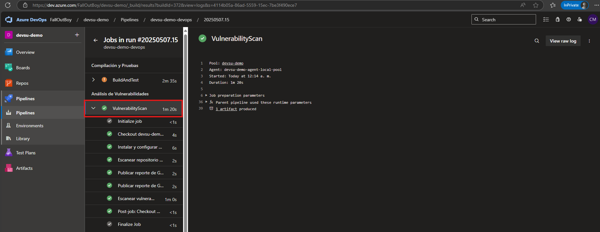
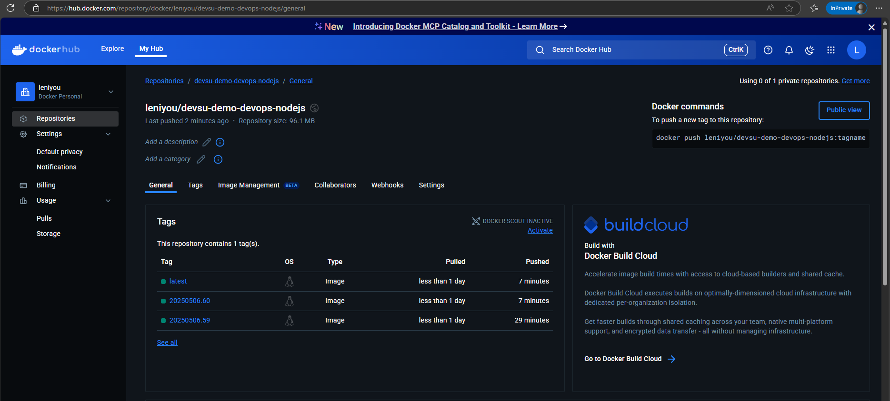

<!-- ommit in toc -->
# 🧪 Devsu Demo DevOps - Ejercicio Práctico -

Este documento describe el proceso completo implementado para cumplir con la prueba técnica solicitada, incluyendo la construcción del código, pruebas unitarias, análisis estático, cobertura, escaneo de vulnerabilidades, construcción, publicación de la imagen Docker y despliegue utilizando Kubernetes.

- [🧪 Devsu Demo DevOps - Ejercicio Práctico -](#-devsu-demo-devops---ejercicio-práctico--)
  - [1. 💻 Requisitos del Ejercicio Práctico DevOps](#1--requisitos-del-ejercicio-práctico-devops)
    - [1.1. 📝 Desarrollar los siguientes puntos](#11--desarrollar-los-siguientes-puntos)
  - [2. ⚡ Desarrollo del Ejercicio Práctico DevOps](#2--desarrollo-del-ejercicio-práctico-devops)
    - [2.1. ⚠️ Prerrequisitos](#21-️-prerrequisitos)
    - [2.2. 🔧 Configuración de la aplicación](#22--configuración-de-la-aplicación)
      - [2.2.1. Configuración de ESLint para análisis de código estático](#221-configuración-de-eslint-para-análisis-de-código-estático)
      - [2.2.2. Configuración de pruebas unitarias con Jest](#222-configuración-de-pruebas-unitarias-con-jest)
      - [2.2.3. Editar archivo `package.json`](#223-editar-archivo-packagejson)
    - [2.3. 🎯 Ejecutar y probar la aplicación](#23--ejecutar-y-probar-la-aplicación)
    - [2.4. 🐋 Dockerizar la aplicación](#24--dockerizar-la-aplicación)
    - [2.5. 📡 Configurar Aplicaciones Externas](#25--configurar-aplicaciones-externas)
      - [2.5.1. Configurar SonarQube](#251-configurar-sonarqube)
      - [2.5.2. Configurar Snyk](#252-configurar-snyk)
      - [2.5.3. Configurar cuenta en Docker Hub](#253-configurar-cuenta-en-docker-hub)
    - [2.6. 🔀 Configurar CI con Azure Pipelines](#26--configurar-ci-con-azure-pipelines)
      - [2.6.1. Crear un Proyecto en Azure DevOps](#261-crear-un-proyecto-en-azure-devops)
      - [2.6.2. Crear Repositorio en Azure DevOps](#262-crear-repositorio-en-azure-devops)
      - [2.6.3. Instalar Self-hosted Agent](#263-instalar-self-hosted-agent)
      - [2.6.4. Instalar extensiones en Azure DevOps](#264-instalar-extensiones-en-azure-devops)
      - [2.6.5. Configurar Service Connections Azure DevOps](#265-configurar-service-connections-azure-devops)
      - [2.6.6. Configurar Secrets en Azure DevOps](#266-configurar-secrets-en-azure-devops)
      - [2.6.7. Crear el ambiente Prod en el Pipeline](#267-crear-el-ambiente-prod-en-el-pipeline)
      - [2.6.8. Configurar Archivos Azure Pipelines](#268-configurar-archivos-azure-pipelines)
    - [2.7. ⚓ Configurar CD con K8s](#27--configurar-cd-con-k8s)
      - [2.7.1 Instalar Minikube](#271-instalar-minikube)
      - [2.7.2. Crear estructura de directorios para K8s](#272-crear-estructura-de-directorios-para-k8s)
      - [2.7.3. Crear una entrada en el archivo hosts de Windows](#273-crear-una-entrada-en-el-archivo-hosts-de-windows)
  - [2.8. 🚀 Ejecución del Pipeline](#28--ejecución-del-pipeline)
    - [2.8.1. Evidencias pruebas unitarias](#281-evidencias-pruebas-unitarias)
    - [2.8.2. Evidencias análisis de SonarQube](#282-evidencias-análisis-de-sonarqube)
    - [2.8.3. Evidencias escáner de vulnerabilidades](#283-evidencias-escáner-de-vulnerabilidades)
    - [2.8.4. Evidencias construir imagen Docker](#284-evidencias-construir-imagen-docker)
    - [2.8.5. Evidencias despliegue con K8s\<a id="285-evidencias-despliegue-con-k8s\>](#285-evidencias-despliegue-con-k8sa-id285-evidencias-despliegue-con-k8s)

## 1. 💻 Requisitos del Ejercicio Práctico DevOps<a id="1--requisitos-del-ejercicio-práctico-devops"></a>

Para este ejercicio deberá elegir de base sólo una de las aplicaciones que se encuentran en el zip adjunto (Dar clic en 'Download starter project' al final de estas instrucciones):

- Java: demo-devops-java
- Node: demo-devops-nodejs
- Python: demo-devops-python

Las aplicaciones son similares, excepto que están escritas en diferentes lenguajes.

En el archivo README.md de cada aplicación encontrará las instrucciones para ejecutar la aplicación y correr las pruebas.

### 1.1. 📝 Desarrollar los siguientes puntos<a id="11--desarrollar-los-siguientes-puntos"></a>

- Dockerizar la aplicación. Siéntase libre de mejorar/cambiar y agregar lo que crea necesario:
  - env vars,
  - run user,
  - port,
  - healthcheck,
  - etc.

- Se debe generar un pipeline como código que idealmente incluya los siguientes pasos:
  - Code Build
  - Unit Tests
  - Static Code analysis
  - Code Coverage
  - Construir y subir la imagen (Docker build & push)
  - Opcionales
    - Vulnerability scan
    - Puede agregar nuevos test si lo cree necesario.

- Desplegar la aplicación dockerizada en kubernetes, no se requiere que utilice un entorno publico, puede utilizar `minikube/docker-desktop` en un entorno local. Intente utilizar todos los recursos que crea necesarios, es decir, lo que utilizaría para que la app esté productiva. Se requiere por lo menos dos réplicas y escalamiento horizontal.
  - Configmaps
  - Secrets
  - Ingress
  - etc.

- Agregar en el pipeline el despliegue a Kubernetes.

- Documentación en el archivo README.md, que incluya:
  - Diagramas
  - Si hizo el despliegue en un entorno públicamente accesible, por favor comparta la URL para poder validar el acceso.

## 2. ⚡ Desarrollo del Ejercicio Práctico DevOps<a id="2--desarrollo-del-ejercicio-práctico-devops"></a>

A continuación se describe todo el proceso llevado a cabo para completar el ejercicio práctico. Para el mismo se ha optado por usar las siguientes herramientas:

- Node: demo-devops-nodejs
- Visual Studio Code.
- Docker Desktop (Windows).
- Docker Hub (registro de contenedores)
- Azure DevOps (Azure Repos, Azure DevOps pipeline y Self-hosted Agent).
- SonarQube (para análisis de código y cobertura).
- ESLint (para escaneo de código estático de JavaScript).
- Postman (para enviar peticiones POST a la aplicación)
- Herramientas de DevSecOps:
  - Trivy (para escaneo de vulnerabilidades de la imagen Docker).
  - Snyk (para escaneo de vulnerabilidades del repositorio).
  - Gitleaks (para escaneo de secrets, password y credenciales expuestas).
- minikube/docker-desktop.

### 2.1. ⚠️ Prerrequisitos<a id="21-️-prerrequisitos"></a>

Para completar este ejercicio es necesario tener instaladas y configuradas las siguientes aplicaciones:

- Descargar [Docker Desktop para Windows](https://desktop.docker.com/win/main/amd64/Docker%20Desktop%20Installer.exe?utm_source=docker&utm_medium=webreferral&utm_campaign=dd-smartbutton&utm_location=module)
- Poseer una cuenta en [Docker Hub](https://hub.docker.com/)
- Descargar [Git](https://git-scm.com/downloads) la terminal donde se ejecutarán los comandos git.
- Descargar [Node.js para Windows](https://nodejs.org/dist/v22.15.0/node-v22.15.0-x64.msi)
- Descargar [Postman para Windows](https://dl.pstmn.io/download/latest/win64)
- Descargar [Visual Studio Code para Windows](https://code.visualstudio.com/download)
- Poseer o crear una [Organización en Azure DevOps](https://learn.microsoft.com/es-es/azure/devops/organizations/accounts/create-organization?view=azure-devops)
- Una cuenta de [Snyk](https://app.snyk.io/account)
- Java [JRE](https://www.java.com/en/download/manual.jsp) y [JDK](https://www.oracle.com/java/technologies/downloads/#jdk24-windows) para las tareas de SonarQube del pipeline.

### 2.2. 🔧 Configuración de la aplicación<a id="22--configuración-de-la-aplicación"></a>

1. Se seleccionó la aplicación `Node: demo-devops-nodejs` para trabajar este ejercicio práctico. Luego de descargar y descomprimir el directorio se procede a abrir en el editor de código, en este caso Visual Studio Code, y se inicializa el directorio como un proyecto git, ejecutando el comando `git init` como se muestra en la siguiente imagen:

    

2. Luego se crea una carpeta llamada `src` para separar el código fuente de los archivos que se irán agregando a lo largo del ejercicio. Se ejecuta el siguiente comando:

    ```bash
    mkdir src && mv shared/ users/ index.js index.test.js README.md .env src
    ```

    Debe quedar así:

    

3. Siguiendo las instrucciones del archivo [README.md](src\README.md) se instalan las dependencias de la aplicación para hacer pruebas locales:

    ```bash
    npm install
    ```

    

4. De momento no se va a iniciar la aplicación. Antes de se ejecutan las pruebas unitarias:

    ```bash
    npm run test
    ```

    

    Con esto se valida que las pruebas están correctas, sin embargo, estas no generan ningún archivo de reporte ni cobertura de código, por lo cual se debe crear un archivo de [Jest](#222-configuración-de-pruebas-unitarias-con-jest) con esas configuraciones.

#### 2.2.1. Configuración de ESLint para análisis de código estático<a id="21-configuración-de-eslint-para-análisis-de-código-estático"></a>

1. Lo primero es instalar ESLint como dependencia de desarrollo para ser usada en el proceso de CI:

    ```bash
    npm install eslint --save-dev
    ```

2. Luego se crea un archivo llamado `eslint.config.js` en la raíz del proyecto con el siguiente contenido:

    ```js
    export default [
        {
            files: ['**/*.js'],
            languageOptions: {
                ecmaVersion: 2021,
                sourceType: 'module',
            },
            rules: {
                semi: ['error', 'always'],
                quotes: ['error', 'single'],
                'no-unused-vars': 'warn',
                'no-console': 'off',
            },
        },
    ];
    ```

    

#### 2.2.2. Configuración de pruebas unitarias con Jest<a id="#222-configuración-de-pruebas-unitarias-con-jest"></a>

1. Se crea un directorio llamado `tests` dentro de `src` y se mueve el archivo `index.test.js`:

    ```bash
    mkdir src/tests && mv src/index.test.js src/tests
    ```

    Tambien se debe actualizar la referencia en el archivo `src/tests/index.test.js` para referirse al directorio `src/`:

    ```js
    // Cambiar esta linea:
    import { app, server } from '.'

    // Por esta:
    import { app, server } from '../.';
    ```

2. Ahora se crea el archivo `jest.config.mjs` en la raíz del proyecto para centralizar la configuración de Jest:

    ```bash
    touch jest.config.msj
    ```

    Con el siguiente contenido:

    ```js
    export default {
        rootDir: ".",
        verbose: true,
        testEnvironment: "node",
        transform: {
            "^.+\\.js?$": "babel-jest"
        },
        testRegex: "(/__tests__/.*|(\\.|/)(test|spec))\\.js$",
        collectCoverage: true,
        collectCoverageFrom: [
            "**/*.js",
            "!**/node_modules/**",
            "!**/shared/**",
            "!**/coverage/**",
            "!**/*.test.js"
        ],
        coverageDirectory: "<rootDir>/test-results/coverage",
        coverageReporters: [
            "cobertura",
            "text-summary",
            "html",
            "lcov"
        ],
        coverageThreshold: {
            global: {
                branches: 80,
                functions: 80,
                lines: 80,
                statements: 80
            }
        },
        testResultsProcessor: "jest-sonar-reporter",
        reporters: [
            "default",
            [
                "jest-junit",{
                    outputDirectory: "<rootDir>/test-results",
                    outputName: "junit.xml"
                }
            ]
        ],
    }
    ```

    En esta configuración lo más relevante son estos puntos:

    - El directorio donde se guardarán los reportes de las pruebas y la cobertura `/test-results/`.
    - `collectCoverageFrom: [ ]` indica los archivos de los cuales se extraerá cobertura de código.
    - `coverageReporters: [ ]` los formatos de reporte de cobertura de código.
    - `reporters: [ ]` formatos de reportes de pruebas unitarias.

    Aquí se especifican dos tipos de archivos de reporte `jest-sonar-reporter` y `jest-junit` pero no se tienen estas dependencias instaladas, se deben instalar con este comando:

    ```bash
    npm install --save-dev jest-sonar-reporter jest-junit
    ```

    Se agregan como `devDependencies` puesto que no son necesarias para que la aplicación funcione, solo son necesarias para las pruebas:

    

    También como buena práctica agregar esta carpeta **test-result** al archivo [.gitignore](.gitignore) para que no sea incluida al momento de subir los cambios al repositorio.

#### 2.2.3. Editar archivo `package.json`<a id="#223-editar-archivo-packagejson"></a>

1. Ahora se edita el archivo `package.json` para agregar un script que se ejecutará en el proceso de CI:

    Se agrega este script:

    ```json
    "test:ci": "jest --ci --silent --runInBand --watchAll=false --detectOpenHandles --forceExit --no-cache"
    ```

    Y se elimina este bloque, ya que está incluido en el archivo `jest.config.mjs`

    ```bash
    "jest": {
        "transform": {
          "^.+\\.js?$": "babel-jest"
        }
    }
    ```

    Y se agrega este bloque al final para que `jest-sonar-reporter` pueda generar el reporte tambien:

    ```json
    "jestSonar": {
        "reportPath": "test-results",
        "reportFile": "sonar-report.xml",
        "indent": 4
    }
    ```

2. También es necesario mover la dependencia `"dotenv": "16.0.3"`. Actualmente esta dependencia se encuentra como `devDependecies` y se debe mover a `dependencies` para no omitirla al crear la imagen docker. Más adelante se explica el por qué.

    

3. Si se ejecutan las pruebas nuevamente, se puede ver que ahora se generan los archivos de reporte y la cobertura:

    ```bash
    npm run test
    ```

    

### 2.3. 🎯 Ejecutar y probar la aplicación<a id="#23--ejecutar-y-probar-la-aplicación"></a>

Como se han movido los archivos fuente hacia el directorio `src/` hay que actualizar la referencia en el archivo `package.json` para el script start. Se debe editar esta linea:

```json
// Esta linea
"start": "node index.js",

// Por esta:
"start": "node src/index.js",
```

Ahora se ejecuta la aplicación con el comando:

```bash
npm run start
```

Y se accede a la url `http://localhost:8000/api/users`


De momento la aplicación no contiene ningún dato. Se pueden enviar datos a la aplicación en formato `json` mediante método el `POST` según se explica en el [README.md](src\README.md#create-user).

```bash
  Method: POST
```

```json
{
    "dni": "dni",
    "name": "name"
}
```

Esto se puede hacer con el comando `curl` pero para esta prueba se usa la app `Postman` que se descargó en la sección de los [Prerrequisitos](#21-️-prerrequisitos).


Según el [README.md](src/README.md#get-user) se utiliza el método `GET` para ver los datos introducidos. Se cambia el hacia el método `GET` en Postman:


Si se accede a la url `http://localhost:8000/api/users/<id>` especificando el número de id 1 se pueden obtener los datos:


Con esto se confirma que la aplicación funciona correctamente. Ahora se va a crear el [Dockerfile](Dockerfile) para dockerizar la aplicación.

### 2.4. 🐋 Dockerizar la aplicación<a id="24--dockerizar-la-aplicación"></a>

En este punto es necesario tener instalada y configurada la aplicación `Docker Desktop` mencionada en la sección de los [Prerrequisitos](#21-️-prerrequisitos), la aplicación debe estar en ejecución para poder ejecutar los comandos de `docker`.

1. Activar `Kubernetes` puesto que será necesario en pasos posteriores.

    Evidencias:

    

2. Se crea el archivo [Dockerfile](Dockerfile) con las instrucciones para dockerizar la aplicación:

    ```bash
    touch Dockerfile
    ```

    Con el siguiente contenido:

    ```bash
    # -- Builder: Etapa de construcción
    FROM node:23.11.0-alpine3.21 AS builder

    WORKDIR /src
    COPY package*.json ./
    RUN npm install --omit=dev --no-audit --progress=false \
        && npm cache clean --force

    COPY . .

    # -- Runtime: Ejecutar la aplicación
    FROM node:23.11.0-alpine3.21 AS runtime

    # Establecer variables de entorno
    ENV NODE_ENV=development \
        PORT=8000 \
        TZ=America/Santo_Domingo

    WORKDIR /app

    # Copiar solo lo necesario desde la etapa anterior
    COPY --from=builder /src /app

    # Instala curl y tzdata, y da permisos a la carpeta de trabajo
    RUN apk add --no-cache --update curl tzdata \
        && rm -rf /var/cache/apk/* \
        && chown -R node:node /app && chmod -R 755 /app \
        && chmod +x /app/src/scripts/*.sh

    # Cambiar a usuario 'node' no root
    USER node

    # Exponer el puerto
    EXPOSE 8000

    # Healthcheck simple basado en la ruta /
    HEALTHCHECK --interval=30s --timeout=10s --start-period=5s --retries=3 \
      CMD curl -f http://localhost:8000/ || exit 1

    # Comando para iniciar la app
    ENTRYPOINT ["/app/src/scripts/entrypoint.sh"]
    ```

    Este `Dockerfile` contiene lo siguiente:

    - Dos etapas: Una etapa llamada `builder` para instalar solo las dependencias necesarias. Y una llamada `runtime` con los archivos y paquetes necesarios para que la aplicación funcione.
    - Se usa una imagen ligera de Node.js para que la imagen final no ocupe demasiado espacio: `node:23.11.0-alpine3.21`
    - Se instalan solo las dependencias necesarias y no se instalan las dependencias de desarrollo para ahorrar aún más espacio. En un principio la dependencia `"dotenv": "16.0.3"` estaba como dependencia de desarrollo (devDependencies), pero esta es una dependencia necesaria para que la aplicación funcione, por eso fue colocada como dependencia principal (dependencies) en el archivo `package.json`.
    - Se instalan solo los paquetes de sistema necesarios como `curl` para que la instrucción `HEALTHCHECK --interval=30s --timeout=10s --start-period=5s --retries=3 CMD curl -f http://localhost:8000/ || exit 1` funcione correctamente.

3. En este punto también se agrega un bloque de código en el archivo `src/index.js` para que responda a las peticiones con `curl` en la URL `localhost:8000`

    ```js
    app.get('/', (req, res) => {
        res.status(200).send('OK');
    });
    ```

    Debe quedar así:

    

4. Se crea la imagen Docker para probar su correcto funcionamiento:

    ```bash
    docker build -t devsu-demo-devops-nodejs .
    ```

    Evidencias:

    

    

5. Se crea el contenedor con el siguiente comando para validar que la imagen se ha creado correctamente:

    ```bash
    docker run --name devsu-test -d devsu-demo-devops-nodejs:latest -p 8000:8000
    ```

    Evidencias:
    

6. Por último se crea el archivo `.dockerignore` en la raíz del proyecto. Este archivo le dice a Docker cuales directorios y archivos excluir al momento de construir la aplicación, lo cual es importante para reducir el tamaño de la imagen final al no copiar archivos innecesarios.

    ```bash
    touch .dockerignore
    ```

    `.dockerignore`

    ```bash
    # Directories to ignore
    # when building the Docker image
    .azure-pipelines
    .vscode
    .git
    node_modules
    src/tests
    test-results
    assets
    environment
    evidencias

    # Files to ignore
    # when building the Docker image
    .babelrc
    .dockerignore
    .gitignore
    azure-pipelines.yml
    Dockerfile
    eslint.config.js
    jest.config.mjs
    package-lock.json
    sonar-project.properties
    *.log
    *.sqlite
    *.test.js
    *.md
    ```

### 2.5. 📡 Configurar Aplicaciones Externas<a id="25--configurar-aplicaciones-externas"></a>

En esta sección se explica la configuración necesaria para las aplicaciones externas que serán integradas al Pipeline de Azure DevOps como son: registro de contenedores en Docker Hub, SonarQube, Snyk, etc.

#### 2.5.1. Configurar SonarQube<a id="251-configurar-sonarqube"></a>

1. Ya que se tiene Docker Desktop instalado, se puede usar la imagen docker oficial de SonarQube y correrlo localmente.

    

    Se configura el contenedor para iniciar en el `puerto 9000`:

    

    Se accede a la URL `localhost:9000` y se completa la configuración inicial, las credenciales son `username=admin` y `password=admin`:

    

2. Ahora hay que configurar un Token para poder registrar el código de la aplicación analizado por SonarQube al momento de ejecutar el CI Pipeline en Azure DevOps. Para esto hay que dirigirse al menú `Administrator > My Account > Security`:

      - name = azure-devops-ci (puede ser cualquier nombre descriptivo)
      - Type = Global Analysis Token
      - Expires in = 30 days

      

      > NOTA: Se debe guardar el token en un lugar seguro puesto que solo se muestra una vez.

3. Ahora se crea un archivo con la configuración de SonarQube en la raíz del proyecto:

    ```bash
    touch sonar-project.properties
    ```

    `sonar-project.properties`

    ```bash
      sonar.projectKey=devsu-demo-devops-nodejs
      sonar.sources=src
      sonar.exclusions=**/node_modules/**,**/test/**,**/tests/**,**/coverage/**,**/assets/**,**/logs/**,**/.azure-pipelines/**,**/.git/**,eslint.config.js
      sonar.javascript.lcov.reportPaths=test-results/coverage/lcov.info
      sonar.testExecutionReportPaths=test-results/sonar-report.xml
    ```

    En este archivo se específica:

    - **sonar.projectKey**: Nombre del proyecto.
    - **sonar.sources**: Directorio con el código fuente que SonarQube analizará.
    - **sonar.exclusions**: Archivos que no se van a analizar.
    - **sonar.javascript.lcov.reportPaths** y **sonar.testExecutionReportPaths**: La ruta de los reportes que se generan al ejecutar las pruebas.

Con eso se finaliza la configuración de SonarQube. Como nota adicional, es necesario que el contenedor de SonarQube esté corriendo en Docker al momento de correr el CI, sino fallará en el análisis.

#### 2.5.2. Configurar Snyk<a id="252-configurar-snyk"></a>

Como se específico en la sección de [Prerrequisitos](#21-️-prerrequisitos), es necesario contar con una cuenta de Snyk para el escaneo de vulnerabilidades del proyecto. Se puede crear un cuenta free-trial en este [enlace](https://snyk.io)

Luego de crear la cuenta gratuita se debe conocer el token que servirá para conectar este servicio con Azure DevOps:


También se puede consultar este [enlace](https://docs.snyk.io/scm-ide-and-ci-cd-integrations/snyk-ci-cd-integrations/azure-pipelines-integration) que indica como integrar Azure Pipelines con Snyk.

#### 2.5.3. Configurar cuenta en Docker Hub<a id="253-configurar-cuenta-en-docker-hub"></a>

La cuenta en [docker hub](https://hub.docker.com/) servirá para poder subir la imagen docker de la aplicación `devsu-demo-devops-nodejs` al registro y posteriormente descargarla para usarla en nuestro proceso de despliegue con Kubernetes.

### 2.6. 🔀 Configurar CI con Azure Pipelines<a id="26--configurar-ci-con-azure-pipelines"></a>

En esta sección se explica la configuración necesaria para las aplicaciones integradas con Pipeline de Azure DevOps como son SonarQube, Snyk, etc. También se incluyen los archivos que conforman dicho Pipeline.

#### 2.6.1. Crear un Proyecto en Azure DevOps<a id="261-crear-un-proyecto-en-azure-devops"></a>

Como se explicó en la sección de [Prerrequisitos](#21-️-prerrequisitos) se debe poseer una organización en Azure DevOps. Una vez creada la organización, se puede seguir esta guía en la documentación oficial de Microsoft para crear el [proyecto](https://learn.microsoft.com/es-es/azure/devops/organizations/projects/create-project?view=azure-devops&tabs=browser).


Ahora se deben configurar:

- Un Self-hosted Agent (agente auto-hospedado): para poder correr los pipelines en nuestra máquina local.
- Instalar las extensiones que se integran con las aplicaciones externas (Snyk, Trivy, etc...) y que permiten ejecutar las tareas del pipeline y mostrar reportes en el mismo.
- Crear las Service Connections para conectarnos a esas aplicaciones.

#### 2.6.2. Crear Repositorio en Azure DevOps<a id="262-crear-repositorio-en-azure-devops"></a>

Luego de crear el proyecto se debe crear el repositorio en Azure Repos, para eso hay que hacer dirigirse al menú `Repos > New repository`. Le colocamos el nombre **devsu-demo-devops-nodejs** el mismo nombre de nuestro repositorio local.


Luego se debe ejecutar estos comandos en el repositorio que se ha venido trabajando:

```bash
git remote add origin <url del repositorio>
git push -u origin main
```

Si hay algún error relacionado con el merge, se puede ejecutar este otro comando:

```bash
git pull origin main --allow-unrelated-histories
```

#### 2.6.3. Instalar Self-hosted Agent<a id="263-instalar-self-hosted-agent"></a>

Instalar este aplicativo permite correr los pipelines de Azure DevOps usando los recursos de nuestra propia máquina y no usar los agentes de Microsoft que son de pago.

1. Para instalarlo se debe ir a: `Project Settings > Pipelines / Agent pools`. Se agrega un nuevo **Agent pool** de tipo *Self-hosted* con un nombre descriptivo.

    Evidencia:

    

    Luego hay que ir a la pestaña **Security** y agregar permisos para el grupo **\Project Collection Build Service Accounts** como *Service Account*. Con esto se le permite al pipeline usar este agente.

    

2. Luego que se crea el *pool* se debe crear el agente. El agente es un archivo descargable que se debe instalar en nuestra máquina. Se hace 'clic' en **New agent**, se descarga el archivo compatible con nuestro sistema operativo y se siguen las instrucciones para su instalación:

    Evidencia:

    

    Al momento de configurarlo solicitará un PAT *(Personal Access Token)* de Azure DevOps con eso se podrá conectar a nuestro proyecto y al pool. El PAT se obtiene en el menu **User Settings**. Se crea un PAT con Full Access y un nombre descriptivo, es importante colocar una fecha de expiración:

    

    

    Anotar el PAT generado para colocarlo cuando sea solicitado por la configuración del Agent pool. La configuración luce así:

    

    Ahora el agente se muestra en el pool que se creó anteriormente. Aparece *offline* porque no se ha iniciado el agente local. Se debe iniciar cada vez que se corra el pipeline con este comando: `.\run.cmd`.

    

    > Nota: Se debe activar la opción `AZP_AGENT_CLEANUP_PSMODULES_IN_POWERSHELL="true"` para que no hayan conflictos entre la version PowerShell 5 que trae el agente por defecto y PowerShell 7 que "muy probablemente" esté instalada en la máquina Windows.

    Ejecutar el comando en un commando prompt en Windows:

    ```ps
    $env:AZP_AGENT_CLEANUP_PSMODULES_IN_POWERSHELL="true"
    ```

    Ahora si el agente estará listo para ejecutarse sin inconvenientes.

#### 2.6.4. Instalar extensiones en Azure DevOps<a id="264-instalar-extensiones-en-azure-devops"></a>

Las extensiones en Azure DevOps se instalan a nivel de **Organización** y no de *Proyecto*, por lo que hay que dirigirse al menú `Organization Settings > General / Extensions`.



En [Visual Studio | Marketplace](https://marketplace.visualstudio.com/azuredevops/) instalar las siguientes extensiones:

- SARIF SAST Scans Tab
- SonarQube Server
- Docker build task
- trivy Aqua Security
- Snyk Security Scan

Una vez instaladas, aparecerán en la pestaña *Installed*


#### 2.6.5. Configurar Service Connections Azure DevOps<a id="265-configurar-service-connections-azure-devops"></a>

Ahora hay que dirigirse nuevamente al proyecto, al menú `Project Settings > Pipelines / Service connections > Create service connection` para crear las conexión con las aplicaciones externas que usará el pipeline.


1. La primera que se creará es la de Docker Registry, para poder hacer push de la imagen de la aplicación `devsu-demo-devops-nodejs`.

    

2. La siguiente será SonarQube Server. Aquí se debe utilizar el token que se generó en el paso anterior [Configurar SonarQube](#251-configurar-sonarqube):

      - **Server url**: Debe ser igual que la url y el puerto donde se inició el contenedor de SonarQube y debe estar *en ejecución* para que se pueda agregar el *Service Connection*.
      - **Token**: El token generado en SonarQube en el paso previo.

      

3. Ahora se configura la conexión con Snyk. Aqui se debe utilizar el token que se generó en el paso previo [Configurar Snyk](#252-configurar-snyk).

    

#### 2.6.6. Configurar Secrets en Azure DevOps<a id="266-configurar-secrets-en-azure-devops"></a>

Se crearán unas variables tipo secrets que harán referencia a los Service Connections que se crearon recientemente, para poder usarlos como variables en el pipeline.

Para esto hay que ir al menú `Pipelines > Library`:

Se crea un nuevo grupo de variables llamado **global-secrets** que será usado en el pipeline.


Se agregan las variables que hacen referencia a los *Service Connections*, adicional a esto también se agrega una variable llamada **sonarToken** con el token de SonarQube generado en pasos previos y **dockerRepositoryName** con el nombre de usuario y el nombre del repositorio `user/nombre-del-repositorio` para que se pueda hacer `docker push` de la imagen.

#### 2.6.7. Crear el ambiente Prod en el Pipeline<a id="267-crear-el-ambiente-prod-en-el-pipeline"></a>

Se crea un ambiente llamado **prod** en el pipeline para aprobar manualmente los pases a producción:

Evidencia:



Luego se asigna el grupo que deberá aprobar el despliegue al ambiente de producción:


#### 2.6.8. Configurar Archivos Azure Pipelines<a id="268-configurar-archivos-azure-pipelines"></a>

En esta parte se crean los archivos que conformarán el CI pipeline de Azure DevOps.

1. Se crea el archivo `azure-pipelines.yml` en la raíz del proyecto:

    ```bash
    touch azure-pipelines.yml
    ```

    Con el contenido:

    ```yaml
      trigger:
      branches:
        include:
          - main

    pool:
      name: 'devsu-demo'

    variables:
      - template: .azure-pipelines/variables.yml
      - group: global-secrets

    parameters:
      - name: environments
        type: object
        default:
          - dev
          - qa

    stages:
      - stage: IntegracionContinua
        displayName: Compilación y Pruebas
        jobs:
          - job: BuildAndTest
            steps:
              - template: .azure-pipelines/code-build-and-test.yml
                parameters:
                  repositoryName: '$(Build.Repository.Name)'
                  sonarqubeServiceName: '$(sonarqubeServiceName)'
                  sonarToken: '$(sonarToken)'

      - stage: DevSecOps
        displayName: Análisis de Vulnerabilidades
        dependsOn: [IntegracionContinua]
        jobs:
          - job: VulnerabilityScan
            steps:
              - template: .azure-pipelines/vulnerability-scan.yml
                parameters:
                  repositoryName: '$(Build.Repository.Name)'
                  snykServiceName: '$(snykServiceName)'
      
      - stage: Dockerizar
        dependsOn: [IntegracionContinua, DevSecOps]
        jobs:
          - job: DockerBuildAndPush
            displayName: Construir y subir la imagen Docker
            steps:
              - template: .azure-pipelines/build-and-push-docker.yml
                parameters:
                  dockerRepositoryName: '$(dockerRepositoryName)'
                  dockerContainerRegistry: '$(dockerContainerRegistry)'

      - stage: DespliegueContinuo
        dependsOn: [Dockerizar]
        displayName: DeployToK8s
        jobs:
          - job: DeployToK8s
            displayName: Despliegue a ambientes pre-productivos
            strategy:
              matrix:
                ${{ each env in parameters.environments }}:
                  ${{ env }}:
                      ENV_NAME: ${{ env }}
            steps:
              - template: .azure-pipelines/deploy-to-k8s.yml
                parameters:
                  environmentName: '$(ENV_NAME)'

      # stage separado para producción con aprobación manual
      - stage: DeployProd
        dependsOn: [DespliegueContinuo]
        condition: succeeded()
        jobs:
          - deployment: DeployToProd
            displayName: Despliegue a ambiente productivo
            environment: 'prod'
            strategy:
              runOnce:
                deploy:
                  steps:
                    - template: .azure-pipelines/deploy-to-k8s.yml
                      parameters:
                        environmentName: 'prod'
    ```

    Explicación:

    - **trigger**: Para iniciar el pipeline al momento de hacer *push* en la rama main.
    - **pool**: El nombre del *Agent pool* que se creó en el paso previo [Instalar Self-hosted Agent](#262-instalar-self-hosted-agent).
    - **variables**: Para incluir el *grupo de variables* que se creó en el paso previo [Configurar Secrets](#265-configurar-secrets-en-azure-devops). Y un archivo de variables para centralizarlas.
    - **stages**: Cada *stage* cumple un requerimiento del ejercicio práctico. En el primero se construye y se prueba la aplicación, en el segundo se escanea la aplicación para buscar vulnerabilidades, y el tercero construye la imagen docker, la analiza con Trivy y luego hace el *push* al registro de Docker Hub.

    Más adelante se agregará otro **stage** para hacer deploy con Kubernetes.

2. Ahora se crea un directorio nuevo para alojar los archivos del pipeline:

    ```bash
    mkdir .azure-pipelines
    ```

3. Se crea el archivo **code-build-and-test.yml** para construir y probar la aplicación:

    ```bash
    touch .azure-pipelines/code-build-and-test.yml
    ```

    Con el siguiente contenido:

    ```yaml
    ---
    parameters:
      - name: repositoryName
        type: string
      - name: sonarqubeServiceName
        type: string
      - name: sonarToken
        type: string
      - name: nodeVersion
        type: string
        default: '$(nodeVersion)'

    steps:

      # -- Code Build / Instalación de dependencias -- #
      - task: NodeTool@0
        displayName: "Instalar Node.js ${{ parameters.nodeVersion }}"
        inputs:
          versionSpec: '${{ parameters.nodeVersion }}'

      - pwsh: |
          Write-Host "Instalando dependencias de Node.js"
          npm install
        displayName: "Instalar dependencias de Node.js"

      # -- Unit Tests / Pruebas Unitarias-- #
      - pwsh: |
          Write-Host "Ejecutando pruebas unitarias"
          npm run test:ci
        displayName: "Ejecutar pruebas unitarias"
        continueOnError: true

      - task: PublishTestResults@2
        displayName: "Publicar resultados de pruebas unitarias"
        inputs:
          testResultsFormat: 'JUnit'
          testResultsFiles: 'junit.xml'
          searchFolder: "$(System.DefaultWorkingDirectory)/test-results"

      # -- ESLint static code analysis / Análisis Estático de código con ESLint -- #
      - pwsh: |
          Write-Host "Ejecutando análisis de código estático con ESLint"
          npx eslint . --ext .js
        displayName: "Ejecutar análisis de código estático con ESLint"
        continueOnError: true

      # -- SonarQube static code analysis / Análisis de código con SonarQube  -- #
      - task: SonarQubePrepare@7
        displayName: "Preparar análisis de SonarQube"
        inputs:
          SonarQube: '${{ parameters.sonarqubeServiceName }}'
          scannerMode: 'cli'
          configMode: 'file'
          cliProjectKey: '${{ parameters.repositoryName }}'
          cliProjectName: '${{ parameters.repositoryName }}'
          cliSources: 'src'
          extraProperties: |
            sonar.token=${{ parameters.sonarToken }}
        
      - pwsh: |
          Write-Host "ls"
          ls $(System.DefaultWorkingDirectory)/test-results/*

      - task: SonarQubeAnalyze@7
        displayName: "Analizar código con SonarQube"
        inputs:
          jdkversion: 'JAVA_HOME'

      - task: SonarQubePublish@7
        displayName: "Publicar resultados de SonarQube"
        inputs:
          pollingTimeoutSec: '300'

      # -- Publish Code Coverage / Publicar resultados de cobertura de código -- #
      - task: PublishCodeCoverageResults@2
        displayName: "Publicar resultados de cobertura de código"
        inputs:
          summaryFileLocation: '$(System.DefaultWorkingDirectory)/test-results/coverage/cobertura-coverage.xml'
    ```

    Explicación

    - Los dos primero tasks son para instalar Node.js y las dependencias del proyecto.
    - Luego se ejecutan las pruebas unitarias y se publican los resultados.
    - Se usa ESLint para escaneo y linter del código.
    - Se ejecuta el análisis de SonarQube.
    - Por último se publica el resultado de la cobertura de código.

4. Se crea el archivo **vulnerability-scan.yml** para el análisis de las vulnerabilidades:

    ```bash
    touch .azure-pipelines/vulnerability-scan.yml
    ```

    Con el contenido:

    ```yaml
    ---
    parameters:
      - name: repositoryName
        type: string
      - name: snykServiceName
        type: string
      - name: gitleaksReportDir
        type: string
        default: "$(System.DefaultWorkingDirectory)/.gitleaks_report"

    steps:
      - checkout: self
        persistCredentials: true

      # -- Find secrets with Gitleaks / Escaneo de secretos expuestos con Gitleaks -- #
      - task: PowerShell@2
        displayName: "Instalar y configurar Gitleaks en Windows"
        inputs:
          targetType: 'inline'
          script: |
            $ErrorActionPreference = "Stop"

            # Variables
            $gitleaksUrl = "https://github.com/gitleaks/gitleaks/releases/download/v8.25.1/gitleaks_8.25.1_windows_x64.zip"
            $zipPath = "$env:BUILD_ARTIFACTSTAGINGDIRECTORY\gitleaks.zip"
            $extractPath = "$env:BUILD_ARTIFACTSTAGINGDIRECTORY\gitleaks"

            # Descargar Gitleaks ZIP
            Invoke-WebRequest -Uri $gitleaksUrl -OutFile $zipPath

            # Extraer el ZIP
            Expand-Archive -Path $zipPath -DestinationPath $extractPath -Force

            # Agregar Gitleaks al PATH temporalmente
            $env:Path += ";$extractPath"

            # Verificar versión
            gitleaks version

            # Crear directorio de reportes si no existe
            $reportDir = "${{ parameters.gitleaksReportDir }}"
            if (Test-Path -Path $reportDir) {
              Write-Host "El directorio para los reportes Gitleaks ya existe"
            } else {
              Write-Host "Creando directorio de reportes de Gitleaks"
              New-Item -ItemType Directory -Path $reportDir | Out-Null
              Invoke-WebRequest -Uri "https://raw.githubusercontent.com/gitleaks/gitleaks/refs/heads/master/report_templates/basic.tmpl" -OutFile "$reportDir\basic.tmpl"
            }

      - task: PowerShell@2
        displayName: "Escanear repositorio con Gitleaks"
        inputs:
          targetType: 'inline'
          script: |
            $ErrorActionPreference = "Stop"
      
            $reportDir = "${{ parameters.gitleaksReportDir }}"
            $gitleaksPath = "$env:BUILD_ARTIFACTSTAGINGDIRECTORY\gitleaks\gitleaks.exe"
      
            # Ejecutar escaneo SARIF
            & "$gitleaksPath" git . --log-opts -1 -v --exit-code 0 --platform azuredevops --report-path "$reportDir\gitleaks-report.sarif" --report-format sarif
      
            # Ejecutar escaneo con plantilla HTML
            & "$gitleaksPath" git . --log-opts -1 -v --exit-code 0 --platform azuredevops --report-path "$reportDir\gitleaks-report.html" --report-format template --report-template "$reportDir\basic.tmpl"
      
      - task: PublishBuildArtifacts@1
        displayName: "Publicar reporte de Gitleaks formato Sarif"
        inputs:
          PathtoPublish: '${{ parameters.gitleaksReportDir }}/gitleaks-report.sarif'
          ArtifactName: 'CodeAnalysisLogs'
          publishLocation: 'Container'

      - task: PublishBuildArtifacts@1
        displayName: "Publicar reporte de Gitleaks formato HTML"
        inputs:
          PathtoPublish: '${{ parameters.gitleaksReportDir }}/gitleaks-report.html'
          ArtifactName: 'CodeAnalysisLogs'
          publishLocation: 'Container'

      # -- Snyk vulnerability scan / Escaneo de vulnerabilidades con Snyk -- #
      - task: SnykSecurityScan@1
        displayName: "Escanear vulnerabilidades con Snyk"
        inputs:
          projectName: '${{ parameters.repositoryName }}'
          serviceConnectionEndpoint: '${{ parameters.snykServiceName }}'
          testType: 'app'
          monitorWhen: 'always'
          failOnIssues: false
    ```

    Explicación:

    - Se instala y configura Gitleaks para el escaneo de secretos, passwords y llaves expuestas.
    - Se ejecuta el análisis de Snyk para escaneo de vulnerabilidades y dependencias deprecadas.

5. Se crea el archivo **build-and-push-docker.yml** para construir y subir la imagen Docker al registro Docker Hub.

    ```bash
      touch .azure-pipelines/build-and-push-docker.yml
    ```

    Con el contenido:

    ```yaml
    ---
    parameters:
      - name: repositoryName
        type: string
        default: 'devsu-demo-devops-nodejs'
      - name: dockerRepositoryName
        type: string
      - name: dockerContainerRegistry
        type: string

    steps:
      - checkout: self
        lfs: true

      - task: Docker@2
        displayName: 'Iniciar sesión Docker Hub'
        inputs:
          command: 'login'
          containerRegistry: ${{ parameters.dockerContainerRegistry }}

      # -- Docker build -- #
      - task: Docker@2
        displayName: "Construir imagen con Docker build"
        inputs:
          command: 'build'
          containerRegistry: '${{ parameters.dockerContainerRegistry }}'
          repository: '${{ parameters.dockerRepositoryName }}'
          buildContext: '.'
          Dockerfile: "**/Dockerfile"
          tags: |
            $(Build.BuildNumber)
            latest

      # -- Escaneo de vulnerabilidades en la imagen Docker con Trivy -- #
      - template: trivy-scan.yml
        parameters:
          dockerRepositoryName: '${{ parameters.dockerRepositoryName }}'

      # -- Docker Push al registro en DockerHub -- #
      - task: Docker@2
        displayName: "Subir imagen con Docker push"
        inputs:
          command: 'push'
          containerRegistry: '${{ parameters.dockerContainerRegistry }}'
          repository: '${{ parameters.dockerRepositoryName }}'
          tags: |
            $(Build.BuildNumber)
            latest
    ```

    Explicación:

    - Se autentica en Docker Hub.
    - Se construye la imagen local con el comando `docker build`.
    - Se analiza la imagen construida con Trivy para buscar vulnerabilidades criticas y altas.
    - Se hace *push* de la imagen hacia el registro de Docker Hub.

6. Se crea el archivo **trivy-scan.yml** para escanear vulnerabilidades en la imagen Docker.

    ```bash
      touch .azure-pipelines/trivy-scan.yml
    ```

    Con el contenido:

    ```yaml
    ---
    parameters:
      - name: dockerRepositoryName
        type: string

    steps:
      # -- Escaneo de vulnerabilidades en la imagen Docker con Trivy -- #
      - task: trivy@2
        displayName: "Escaneo de vulnerabilidades con Trivy"
        inputs:
          method: install
          version: latest
          type: 'image'
          target: "docker.io/${{ parameters.dockerRepositoryName }}:$(Build.BuildNumber)"
          scanners: 'vuln'
          ignoreUnfixed: true
          ignoreScanErrors: true
          severities: 'CRITICAL,HIGH'
          reports: 'html, sarif'
          publish: true
          exitCode: 0
    ```

7. Se crea el archivo **.azure-pipelines/deploy-to-k8s.yml** con las tareas para el despliegue de la aplicación en un cluster local de Kubernetes usando minikube.

    ```bash
      touch .azure-pipelines/deploy-to-k8s.yml
    ```

    Con el contenido:

    ```yaml
    ---
    parameters:
      - name: k8sOverlayPath
        type: string
        default: '$(k8sOverlayPath)'
      - name: environmentName
        type: string
    
    steps:
      - pwsh: |
          Write-Host "Aplicando manifestos con Kustomize desde: ${{ parameters.k8sOverlayPath }}/${{ parameters.environmentName }}"
          & kubectl apply -k "${{ parameters.k8sOverlayPath }}/${{ parameters.environmentName }}"
        displayName: 'Aplicar Kustomize'

      - pwsh: |
          Write-Host "Esperando a que el deployment esté disponible..."
          & kubectl rollout status -n ${{ parameters.environmentName }}-devsu-demo-devops-nodejs deployment devsu-demo-devops-nodejs-${{ parameters.environmentName }} --timeout=120s
          if ($LASTEXITCODE -ne 0) {
              Write-Error "Deployment no disponible. Revisa los eventos de Kubernetes."
              exit 1
          }
        displayName: 'Esperar rollout del Deployment'
      
      - task: PowerShell@2
        displayName: "Validar rollout ${{ parameters.environmentName }}"
        inputs:
          targetType: inline
          script: |
            $ns = "${{ parameters.environmentName }}-devsu-demo-devops-nodejs"
            kubectl get pods -n $ns
            kubectl rollout status deployment/devsu-demo-devops-nodejs-${{ parameters.environmentName }} -n $ns

      - pwsh: |
          Write-Host "Recursos desplegados:"
          & kubectl get all | Out-String | Write-Host
          Write-Host "Ingress:"
          & kubectl get ingress | Out-String | Write-Host
        displayName: 'Ver recursos desplegados'
    ```

### 2.7. ⚓ Configurar CD con K8s<a id="27--configurar-cd-con-k8s"></a>

En esta sección se explica como configurar los archivos necesarios para el despliegue de la aplicación en un cluster de Kubernetes local usando Docker Desktop. Tambien se indica como instalar minikube para el manejo y administración de dicho cluster.

#### 2.7.1 Instalar Minikube<a id="271-instalar-minikube"></a>

Para instalar minikube hay que ir al [enlace](https://minikube.sigs.k8s.io/docs/start/?arch=%2Fwindows%2Fx86-64%2Fstable%2F.exe+download#Ingress) y seguir las instrucciones.

Una vez instalado, iniciar el servicio con el comando:

```bash
minikube start
```

Evidencia:


Adicional agregar estos paquetes que será de gran utilidad:

```bash
minikube dashboard
minikube addons enable ingress
minikube addons enable ingress-dns
```

#### 2.7.2. Crear estructura de directorios para K8s<a id="272-crear-estructura-de-directorios-para-k8s"></a>

Se debe crear el directorio environment:

```bash
mkdir -p environment/k8s/devsu-demo-devops-nodejs
```

Y crear la siguiente estructura:

```bash
└──devsu-demo-devops-nodejs
    ├──base
    │       deployment.yml
    │       ingress.yml
    │       kustomization.yml
    │       service.yml
    │
    └──overlays
        ├──dev
        │   │   kustomization.yml
        │   │   namespace.yml
        │   │
        │   ├───patch
        │   │       ingress-patch.yml
        │   │
        │   └───secret
        │           devsu-demo-devops-nodejs.env
        │
        ├──prod
        │   │   kustomization.yml
        │   │   namespace.yml
        │   │
        │   ├───patch
        │   │       ingress-patch.yml
        │   │
        │   └───secret
        │           devsu-demo-devops-nodejs.env
        │
        └──qa
            │   kustomization.yml
            │   namespace.yml
            │
            ├──patch
            │       ingress-patch.yml
            │
            └──secret
                    devsu-demo-devops-nodejs.env
```

Se utilizan plantillas de Kustomize, ya que permite tener todos los archivos más organizados.

1. El archivo **base/deployment.yml** es el archivo base para todos los despliegues y debe contener:

    ```yaml
    ---
    apiVersion: apps/v1
    kind: Deployment
    metadata:
      name: devsu-demo-devops-nodejs
      labels:
        app: devsu-demo
    spec:
      replicas: 3
      selector:
        matchLabels:
          app: devsu-demo-devops-nodejs
      template:
        metadata:
          labels:
            app: devsu-demo
        spec:
          containers:
            - name: devsu-demo-devops-nodejs
              image: image-devsu-demo-devops-nodejs
              imagePullPolicy: Always
              ports:
                - containerPort: 8000
                  protocol: TCP
              envFrom:
                - secretRef:
                    name: secret-devsu-demo-devops-nodejs
              resources:
                limits:
                  memory: "512Mi"
                  cpu: "500m"
                requests:
                  memory: "128Mi"
                  cpu: "250m"
    ```

2. El archivo **base/ingress.yml** servirá para poder acceder a la URL del aplicativo de manera local:

    ```yaml
    ---
    apiVersion: networking.k8s.io/v1
    kind: Ingress
    metadata:
      name: devsu-demo-ingress
      annotations:
        nginx.ingress.kubernetes.io/rewrite-target: /
    spec:
      rules:
        - host: placeholder.local
          http:
            paths:
              - path: /
                pathType: Prefix
                backend:
                  service:
                    name: devsu-demo-service
                    port:
                      number: 8000
    ```

3. El archivo **base/service.yml** sirve para subir el servicio y definir el puerto de la aplicación:

    ```yaml
    ---
    apiVersion: v1
    kind: Service
    metadata:
      name: devsu-demo-service
    spec:
      type: ClusterIP
      ports:
      - name: http
        port: 8000
        protocol: TCP
        targetPort: 8000
      selector:
        app: devsu-demo-devops-nodejs
    ```

4. Por último el archivo **base/kustomization.yml** se usa para incluir todos los archivos definidos anteriormente:

    ```yaml
    apiVersion: kustomize.config.k8s.io/v1beta1
    kind: Kustomization

    resources:
      - deployment.yml
      - service.yml
      - ingress.yml
    ```

Luego se crea el directorio **overlays/<ambiente>** para cada ambiente. Como todos los ambientes tienen la misma configuración y solo varian las variables y la URL en esta sección solo se describirán los archivos para un solo ambiente.

1. Se crea el archivo **overlays/dev/patch/ingress-patch.yml** para reemplazar la URL del host del deployment, por la URL del ambiente, por ejemplo `dev.devsu-demo-devops-nodejs.local`:

    ```yaml
    ---
    apiVersion: networking.k8s.io/v1
    kind: Ingress
    metadata:
      name: dev-devsu-demo-devops-nodejs-ingress
    spec:
      rules:
        - host: dev.devsu-demo-devops-nodejs.local
    ```

2. Se crea el archivo **overlays/dev/secret/devsu-demo-devops-nodejs.env** con las variables de entorno para la aplicación.

    ```bash
    APP_NAME="devsu-demo-devops-nodejs"
    NODE_ENV=development
    PORT=8000

    # -- Base de Datos -- #
    DATABASE_NAME="./dev.sqlite"
    DATABASE_USER="user"
    DATABASE_PASSWORD="password"
    ```

    > Nota la variable `NODE_ENV=development` debe ser reemplazada para cada ambiente con `NODE_ENV=qa` y `NODE_ENV=prod` respectivamente.

3. Se crea el archivo **overlays/dev/namespace.yml** con el nombre del ambiente, en este caso dev, que alojará todos los recursos bajo este mismo namespace.

    ```yaml
    ---
    apiVersion: v1
    kind: Namespace
    metadata:
      name: dev-devsu-demo-devops-nodejs
    ```

4. Se crea el archivo **overlays/dev/kustomization.yml** para incluir todos los recursos creados previamente.

    ```yaml
      ---
      namespace: dev-devsu-demo-devops-nodejs

      nameSuffix: '-dev'

      resources:
        - ../../base
        - namespace.yml

      secretGenerator:
        - name: secret-devsu-demo-devops-nodejs
          envs:
          - secret/devsu-demo-devops-nodejs.env

      patches:
        - target:
            kind: Ingress
            name: dev-devsu-demo-devops-nodejs-ingress
          path: patch/ingress-patch.yml

      images:
        - name: image-devsu-demo-devops-nodejs
          newName: docker.io/leniyou/devsu-demo-devops-nodejs
          newTag: latest
    ```

Ahora solo hay que crear esa misma estructura para los ambientes *qa* y *prod* reemplazando el nombre donde aplique.

#### 2.7.3. Crear una entrada en el archivo hosts de Windows<a id="273-crear-una-entrada-en-el-archivo-hosts-de-windows"></a>

Para acceder de manera local a la aplicación por medio del navegador se agregar una entrada en el archivo `hosts` de Windows. Este archivo se encuentra en: `C:\Windows\System32\drivers\etc\hosts`:

```txt
## Para cluster Kubernetes
127.0.0.1 dev.devsu-demo-devops-nodejs.local
127.0.0.1 qa.devsu-demo-devops-nodejs.local
127.0.0.1 prod.devsu-demo-devops-nodejs.local
```

## 2.8. 🚀 Ejecución del Pipeline<a id="28-ejecución-del-pipeline"></a>

En esta sección se colocaran las evidencias de la ejecución del pipeline. Antes de correr el pipeline se debe ejecutar el comando `minikube tunnel` para poder acceder a las URL de los ambientes.

### 2.8.1. Evidencias pruebas unitarias<a id="281-evidencias-pruebas-unitarias"></a>


Solo falla el Linter porque al código le faltan algunos punto y coma.


### 2.8.2. Evidencias análisis de SonarQube<a id="283-evidencias-análisis-de-sonarqube"></a>


### 2.8.3. Evidencias escáner de vulnerabilidades<a id="283-evidencias-escáner-de-vulnerabilidades"></a>



Gitleaks


Snyk


### 2.8.4. Evidencias construir imagen Docker<a id="284-evidencias-construir-imagen-docker"></a>


Repositorio Docker Hub

[Imagen docker](https://hub.docker.com/repository/docker/leniyou/devsu-demo-devops-nodejs/general)



### 2.8.5. Evidencias despliegue con K8s<a id="285-evidencias-despliegue-con-k8s></a>


Aplicación ejecutandose en kubernetes con minikube-dashboard:


